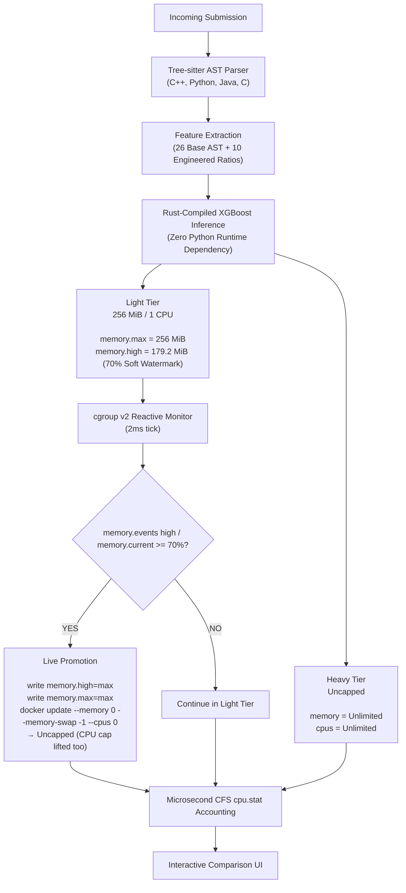

# RAAS-OCJS

**Resource-Aware Adaptive Scheduling for Online Coding Judge Systems**

A next-generation coding programming judge combining **predictive AST-based classification** with **reactive, event-driven Linux cgroup v2 monitoring** to enable dynamic, mid-execution isolation-tier migration on fixed, self-hosted hardware.

> **Final-Year Project**  
> Department of Computer Science and Engineering, Easwari Engineering College.  
> Guided by **Mrs. Indumathy P**, Assistant Professor / CSE.

---

## Table of Contents

- [01. Problem Statement](#01-problem-statement)
- [02. Scheduling Strategies](#02-scheduling-strategies)
- [03. System Architecture](#03-system-architecture)
- [04. Real-World Competition Benchmark Suite](#04-real-world-competition-benchmark-suite)
- [05. Key Innovations & Measurements](#05-key-innovations--measurements)
- [06. Experimental Results](#06-experimental-results)
- [07. Tech Stack](#07-tech-stack)
- [08. Documentation Index](#08-documentation-index)
- [09. Quick Start](#09-quick-start)
- [10. Team](#10-team)

---

## 01. Problem Statement

Standard Online Judges (DOMjudge, DMOJ, VJudge) apply uniform isolation limits to every submission. Evaluating a trivial $O(1)$ query reserves identical CPU and memory headroom as an intensive $O(N^3)$ graph or dynamic programming algorithm. On self-hosted, non-elastic servers, this practice leads to:
1. **Severe Resource Hoarding**: Light jobs tie up server memory reservations, capping submission throughput.
2. **OOM Vuln or Overkill**: Setting limits low causes false Memory-Limit-Exceeded (MLE) verdicts on legitimate heavy programs; setting limits high creates multi-tenant CPU starvation.

**RAAS-OCJS** introduces adaptive multi-tier scheduling that optimizes the sandbox isolation substrate beneath judging without compromising grading criteria.

---

## 02. Scheduling Strategies

RAAS-OCJS provides four switchable scheduling engines:

| Strategy | When Evaluated | Mechanism | Isolation Profile |
|---|---|---|---|
| **Baseline** | Intake | Current standard practice | Always assigns Heavy tier (Uncapped Host Memory & CPU) |
| **Predictive** | Pre-Execution | Tree-sitter AST $\rightarrow$ 36 features (40 unified) $\rightarrow$ Compiled XGBoost | Assigns Light (256 MiB, 1 CPU) or Heavy tier before launching container |
| **Reactive** | Mid-Execution | Linux cgroup v2 event-driven monitoring | Starts in Light tier (256 MiB); promotes to uncapped **memory** once the `memory.events` `high` counter crosses the 70% (~179.2 MiB) watermark. Promotion is memory-only: it lifts `memory.high`/`memory.max` and leaves the CPU quota at the Light tier. A purely CPU-bound submission is therefore never promoted. Note that a direct **Tier 2 placement** (Predictive/Hybrid) is a different ceiling - that one does allocate 2.0 cores |
| **Hybrid** | Both | Predictive start + Reactive live safety net | Starts in ML-predicted tier; actively promotes if memory spikes exceed prediction |

---

## 03. System Architecture


---

> **Results withdrawn.** The experimental numbers formerly in this section have been
> removed. They were produced by a harness whose corpus, cloud target and promotion path
> changed repeatedly, and the figures no longer correspond to any single run. A fresh
> experimental programme is specified in [`docs/TEST_PLAN.md`](TEST_PLAN.md); results will be
> re-derived and re-published against it. Do not cite numbers from this repository's history.

## 04. Tech Stack

- **Judge Server**: Rust (Tokio, Axum, cgroups v2, Linux namespaces).
- **AST Parsing**: Tree-sitter Rust bindings (C, C++, Java, Python).
- **ML Inference**: XGBoost transpiled to pure Rust via `m2cgen` (zero Python dependency at runtime).
- **Frontend Visualizer**: React 19, TypeScript, Vite, Tailwind CSS, Recharts.
- **Training Data**: IBM Project CodeNet (`iNeil77/CodeNet` on HuggingFace; 12.7M rows scanned, from which the 164,686-submission measured-memory corpus is drawn) *or* DeepMind CodeContests (streamed directly from HuggingFace — the earlier, length-heuristic-labelled era).

---

## 05. Documentation Index

Detailed architectural and technical documentation is available in the [`docs/`](docs/) directory:

- [**System Architecture** (`docs/ARCHITECTURE.md`)](docs/ARCHITECTURE.md): Deep dive into the AST pipeline, cgroup controllers, and dual watermark design.
- [**Scheduling Strategies** (`docs/SCHEDULING_STRATEGIES.md`)](docs/SCHEDULING_STRATEGIES.md): Formal breakdown of Baseline, Predictive, Reactive, and Hybrid policies.
- [**Test Plan** (`docs/TEST_PLAN.md`)](docs/TEST_PLAN.md): the experimental programme, and the paper elements each experiment must produce.
- [**Setup & Developer Guide** (`docs/SETUP_GUIDE.md`)](docs/SETUP_GUIDE.md): Complete setup instructions for the judge server, the frontend, the model pipeline, and the benchmark harness.
- [**Model Training Pipeline** (`model-training/README.md`)](model-training/README.md): Dataset extraction (CodeNet **or** CodeContests) → Rust AST feature extraction → XGBoost training → `m2cgen` transpilation into the judge binary.
- [**Feature Extraction Pipeline** (`feature-extraction-pipeline/README.md`)](feature-extraction-pipeline/README.md): The 26 core AST features emitted by the Rust Tree-sitter extractor, plus the 10 engineered ratios added during training (36 features per language; 40 unified).

---

## 06. Quick Start

The predictive models are **already compiled into the judge** ([`server/src/generated/`](server/src/generated/)), regenerated at 36 features (per-language) and 40 (unified) from the CodeNet measured-memory corpus, so steps 1–3 are the only ones required to *run* the system. Step 0 is only needed if you want to retrain on a different dataset (e.g. the earlier CodeContests corpus).

### 0. (Optional) Retrain the models on CodeContests
```bash
cd model-training
python3 -m venv .venv && source .venv/bin/activate
pip install -r requirements.txt

python3 extract_codecontests.py --output-dir ./codecontests_subset \
    --manifest ./sample_manifest_codecontests.csv --per-stratum 5000

(cd ../feature-extraction-pipeline && cargo build --release --bin OJ-feature-extraction-spike)
../feature-extraction-pipeline/target/release/OJ-feature-extraction-spike \
    ./codecontests_subset ./features_codecontests.csv

python3 train_advanced_xgboost.py --features-csv ./features_codecontests.csv \
    --manifest-csv ./sample_manifest_codecontests.csv --output-dir ./artifacts

./regenerate_models.sh        # artifacts/*.joblib -> server/src/generated/*.rs
```
> `regenerate_models.sh` checks each trained model's own `num_features()` and refuses to write on a mismatch, so a stale 32-feature artifact set fails with an error rather than silently overwriting the generated Rust.
Then **sync the new decision thresholds** from `artifacts/model_comparison.csv` into [`server/src/predict.rs`](server/src/predict.rs:22) before building the server. Full details: [`model-training/README.md`](model-training/README.md).

> ⚠️ `extract_codecontests.py` runs `rm -rf` on `--output-dir` and `--manifest` before writing — do not point it at data you need.

### 1. Build Sandbox Images
```bash
docker build -t python-judge-runtime server/runtimes/python
docker build -t cpp-judge-runtime    server/runtimes/cpp
docker build -t java-judge-runtime   server/runtimes/java
```

### 2. Run Judge Server (Must run with `sudo` for Live Promotion)
```bash
cd server
cargo build

# Run with sudo so the server has permissions to write cgroup v2 soft watermarks:
sudo ./target/debug/server
```
> **Note on Live Promotion**: Running with `sudo` is mandatory for the **Reactive** and **Hybrid** strategies to write to `/sys/fs/cgroup/.../memory.high`. Without `sudo`, the kernel returns `Permission denied (os error 13)` and submissions cannot be promoted mid-execution.

### 3. Start Frontend UI
```bash
cd frontend
npm install
npm run dev
```
Navigate to `http://localhost:5173` to launch the multi-strategy visualizer.

### 4. Benchmarking

No benchmark harness is currently committed. The harness and its results were withdrawn along with
the numbers they produced; the replacement is specified in [`docs/TEST_PLAN.md`](TEST_PLAN.md).


## 07. Team

| Name | Role | Responsibilities |
|---|---|---|
| **Hemanthkumar K** | Systems & Infrastructure Lead | Server, Linux cgroup v2 Isolation Manager, CFS Timing, Backend API |
| **Bharath Aashish R** | Frontend & UI/UX Lead | React Visualizer, Recharts Strategy Graphs, Benchmark Code Editor |
| **Dhanush M** | Machine Learning Lead | Dataset Preprocessing, XGBoost Model Training, m2cgen Transpilation |
| **Iniyaa P** | Static Analysis Lead | Tree-sitter Integration, AST Feature Extraction Logic |
