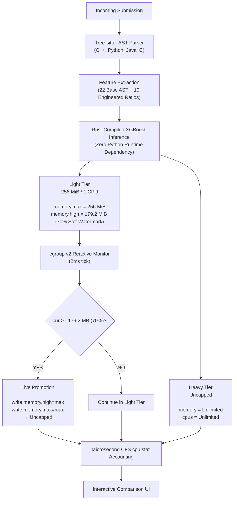

# RAAS-OCJS

**Resource-Aware Adaptive Scheduling for Online Competitive Judge Systems**

A next-generation competitive programming judge combining **predictive AST-based classification** with **reactive, event-driven Linux cgroup v2 monitoring** to enable dynamic, mid-execution isolation-tier migration on fixed, self-hosted hardware.

> **Final-Year Project**  
> Department of Computer Science and Engineering, Easwari Engineering College.  
> Guided by **Mrs. Indumathy P**, Assistant Professor / CSE.

---

## Table of Contents

- [01. Problem Statement](#01-problem-statement)
- [02. Scheduling Strategies](#02-scheduling-strategies)
- [03. System Architecture](#03-system-architecture)
- [04. Real-World Competition Benchmark Suite](#04-real-world-competition-benchmark-suite)
- [05. Key Innovations & Measurements](#05-key-innovations--measurements)
- [06. Experimental Results](#06-experimental-results)
- [07. Tech Stack](#07-tech-stack)
- [08. Documentation Index](#08-documentation-index)
- [09. Quick Start](#09-quick-start)
- [10. Team](#10-team)

---

## 01. Problem Statement

Standard Online Judges (DOMjudge, DMOJ, VJudge) apply uniform isolation limits to every submission. Evaluating a trivial $O(1)$ query reserves identical CPU and memory headroom as an intensive $O(N^3)$ graph or dynamic programming algorithm. On self-hosted, non-elastic servers, this practice leads to:
1. **Severe Resource Hoarding**: Light jobs tie up server memory reservations, capping submission throughput.
2. **OOM Vuln or Overkill**: Setting limits low causes false Memory-Limit-Exceeded (MLE) verdicts on legitimate heavy programs; setting limits high creates multi-tenant CPU starvation.

**RAAS-OCJS** introduces adaptive multi-tier scheduling that optimizes the sandbox isolation substrate beneath judging without compromising grading criteria.

---

## 02. Scheduling Strategies

RAAS-OCJS provides four switchable scheduling engines:

| Strategy | When Evaluated | Mechanism | Isolation Profile |
|---|---|---|---|
| **Baseline** | Intake | Current standard practice | Always assigns Heavy tier (Uncapped Host Memory & CPU) |
| **Predictive** | Pre-Execution | Tree-sitter AST $\rightarrow$ 32 features $\rightarrow$ Compiled XGBoost | Assigns Light (256 MiB, 1 CPU) or Heavy tier before launching container |
| **Reactive** | Mid-Execution | Linux cgroup v2 event-driven monitoring | Starts in Light tier (256 MiB); dynamically promotes to Uncapped if 70% (~179.2 MiB) watermark is crossed |
| **Hybrid** | Both | Predictive start + Reactive live safety net | Starts in ML-predicted tier; actively promotes if memory spikes exceed prediction |

---

## 03. System Architecture


---

## 04. Real-World Competition Benchmark Suite

The system includes five high-stakes competition problems modeled after **Codeforces**, **ICPC**, **LeetCode Hard**, and **AtCoder DP Contest**:

1. **Range Prefix Sums & Cumulative Balance** (`Prefix Sums`, Light)
   - $O(N + Q)$ Time · $O(N)$ Space. Evaluates Light-tier performance with zero cgroup watermark events.
2. **0-1 Knapsack Large State Space (2D Grid DP)** (`Dynamic Programming`, Memory-Heavy)
   - $O(N \times W)$ Time · $O(N \times W)$ Space (~200 MiB RSS). Intentionally breaches the 70% (~179.2 MiB) watermark to verify **live reactive container promotion**.
3. **All-Pairs Shortest Path (Floyd-Warshall Algorithm)** (`Graph`, CPU-Bound)
   - $O(V^3)$ Time · $O(V^2)$ Space ($V=100, 120$). Evaluates Predictive AST detection of triply nested loops (`max_loop_depth = 3`).
4. **Game Tree Search (Binary Branching Recursion)** (`Game Theory`, Recursive)
   - $O(2^N)$ Time · $O(N)$ Stack Depth ($N=30, 32$). Evaluates Tree-sitter detection of branching recursion (`is_recursive`, `recursive_call_count = 2`).
5. **Top-K Streaming Frequencies (Hash Map + Priority Queue)** (`Streaming / Heaps`, Collections)
   - $O(N \log K)$ Time · $O(N)$ Space ($N=30\text{k}, 50\text{k}$). Evaluates heavy STL container detection and demonstrates stable CFS CPU accounting.

---

## 05. Key Innovations & Measurements

1. **Microsecond CFS Kernel CPU Timing (`cpu.stat`)**:
   - Rather than measuring host wall-time around `docker exec` (which adds 150–200 ms of container startup noise), the judge reads `/sys/fs/cgroup/.../cpu.stat` deltas directly from the Linux kernel scheduler.
   - Reduces execution measurement variance from $\pm 200\%$ down to $\le \pm 4\%$.
2. **Soft Watermark Live Migration (`memory.high`)**:
   - Uses `memory.high = 179.2 MiB` (70% of `memory.max`) to detect pressure *before* reaching the 256 MiB hard limit (`memory.max`), preventing kernel OOM-killer panics while avoiding premature tier migration.
   - Executes live container expansion by writing `memory.high=max` and `memory.max=max` directly to the container's host cgroup v2 directory, then issuing `docker update --memory 0 --memory-swap -1 --cpus 0` to keep the Docker daemon's view in sync, in $< 15\text{ ms}$ without dropping running processes.
3. **Unified Allocated vs. Used Memory Tracking**:
   - Explicitly records both the **Peak Memory Used** (actual RSS footprint) and **Memory Allocated** (assigned tier ceiling), enabling direct quantification of infrastructure savings.

---

## 06. Experimental Results

*Measured on the bare-metal calibration host (i5-13420H, 15 GiB, cgroup v2, watermark 179.2 MiB) over the full 5 problems × 4 languages × 4 strategies matrix — 80 live runs, all 80 `AC`.*

| Problem | Strategy | Verdict | Initial Tier | Promoted? | CPU (`cpu.stat`) | Peak RSS | Allocated |
|---|:---:|:---:|:---:|:---:|:---:|:---:|:---:|
| **P1: Prefix Sums** (Python) | Baseline | **AC** | Heavy | No | 54 ms | 10.4 MB | Uncapped |
| | Predictive / Reactive / Hybrid | **AC** | Light | No | 52–56 ms | 10.1–11.1 MB | **256 MiB** |
| **P2: Knapsack (200/210 MiB)** (Java) | Baseline | **AC** | Heavy | No | 247 ms | 248.6 MB | Uncapped |
| | Predictive | **AC** | Light | No | 261 ms | 244.1 MB | 256 MiB |
| | **Reactive / Hybrid** | **AC** | Light | **Yes (810 / 817 ms)** | 272–274 ms | 243.5–243.8 MB | 256 MiB → Uncapped |
| **P3: Floyd-Warshall** (Python) | Baseline | **AC** | Heavy | No | 321 ms | 10.9 MB | Uncapped |
| | Predictive / Reactive / Hybrid | **AC** | Light | No | 306–322 ms | 10.3–11.2 MB | **256 MiB** |
| **P4: Tree Search** (C++) | Baseline | **AC** | Heavy | No | 53 ms | 6.5 MB | Uncapped |
| | Predictive / Reactive / Hybrid | **AC** | Light | No | 51–53 ms | 6.4–6.8 MB | **256 MiB** |
| **P5: Top-K Streaming** (C++) | Baseline | **AC** | Heavy | No | 42 ms | 7.3 MB | Uncapped |
| | Predictive / Reactive / Hybrid | **AC** | Light | No | 41–43 ms | 6.6–7.2 MB | **256 MiB** |

**Aggregate across all 80 runs:** mean CPU is flat across strategies (121.0–126.0 ms, spread 4.2%) — tiering carries no measurable CPU cost. **44 of 80 runs (55%) were held at a hard 256 MiB ceiling**; the rest were Baseline or promoted mid-run. Live promotion fired in **8 of 8** eligible P2 runs and **0** Predictive runs.

> **Predictive fails at the boundary.** On P2 the classifier routed all four languages to Light and, with no watermark monitor running, never promoted. All four survived only because their true peak stayed under the hard limit — Java cleared it by just **24.3 MB (9.1%)**. A 5% larger fixture would have OOM-killed all four. This is the empirical case for keeping the watermark active: the model is fast but not trustworthy at the tier boundary. See `docs/EXPERIMENTAL_RESULTS.md` §4.3.

Raw per-cell measurements are committed in `benchmarks/laptop_matrix_80run.json`.

Full per-language matrix, promotion traces, and threats to validity: [`docs/EXPERIMENTAL_RESULTS.md`](docs/EXPERIMENTAL_RESULTS.md).

---

## 07. Tech Stack

- **Judge Server**: Rust (Tokio, Axum, cgroups v2, Linux namespaces).
- **AST Parsing**: Tree-sitter Rust bindings (C, C++, Java, Python).
- **ML Inference**: XGBoost transpiled to pure Rust via `m2cgen` (zero Python dependency at runtime).
- **Frontend Visualizer**: React 19, TypeScript, Vite, Tailwind CSS, Recharts.
- **Training Data**: IBM Project CodeNet (13.9M submissions) *or* DeepMind CodeContests (streamed directly from HuggingFace — no external drive required).

---

## 08. Documentation Index

Detailed architectural and technical documentation is available in the [`docs/`](docs/) directory:

- [**System Architecture** (`docs/ARCHITECTURE.md`)](docs/ARCHITECTURE.md): Deep dive into the AST pipeline, cgroup controllers, and dual watermark design.
- [**Scheduling Strategies** (`docs/SCHEDULING_STRATEGIES.md`)](docs/SCHEDULING_STRATEGIES.md): Formal breakdown of Baseline, Predictive, Reactive, and Hybrid policies.
- [**Benchmark Suite** (`docs/BENCHMARK_SUITE.md`)](docs/BENCHMARK_SUITE.md): Mathematical formulations, complexity, and test cases for all 5 competition problems.
- [**Experimental Results** (`docs/EXPERIMENTAL_RESULTS.md`)](docs/EXPERIMENTAL_RESULTS.md): Empirical data, stability measurements, and memory savings analysis.
- [**Setup & Developer Guide** (`docs/SETUP_GUIDE.md`)](docs/SETUP_GUIDE.md): Complete setup instructions for the judge server, the frontend, the model pipeline, and the benchmark harness.
- [**Model Training Pipeline** (`model-training/README.md`)](model-training/README.md): Dataset extraction (CodeNet **or** CodeContests) → Rust AST feature extraction → XGBoost training → `m2cgen` transpilation into the judge binary.
- [**Feature Extraction Pipeline** (`feature-extraction-pipeline/README.md`)](feature-extraction-pipeline/README.md): The 22 core AST features emitted by the Rust Tree-sitter extractor, plus the 10 engineered ratios added during training (32 features per language; 36 unified).

---

## 09. Quick Start

The predictive models are **already compiled into the judge** ([`server/src/generated/`](server/src/generated/)), so steps 1–3 are the only ones required to *run* the system. Step 0 is only needed if you want to retrain on a different dataset (e.g. CodeContests).

### 0. (Optional) Retrain the models on CodeContests
```bash
cd model-training
python3 -m venv .venv && source .venv/bin/activate
pip install -r requirements.txt

python3 extract_codecontests.py --output-dir ./codecontests_subset \
    --manifest ./sample_manifest_codecontests.csv --per-stratum 5000

(cd ../feature-extraction-pipeline && cargo build --release --bin OJ-feature-extraction-spike)
../feature-extraction-pipeline/target/release/OJ-feature-extraction-spike \
    ./codecontests_subset ./features_codecontests.csv

python3 train_advanced_xgboost.py --features-csv ./features_codecontests.csv \
    --manifest-csv ./sample_manifest_codecontests.csv --output-dir ./artifacts

./regenerate_models.sh        # artifacts/*.joblib -> server/src/generated/*.rs
```
Then **sync the new decision thresholds** from `artifacts/model_comparison.csv` into [`server/src/predict.rs`](server/src/predict.rs:22) before building the server. Full details: [`model-training/README.md`](model-training/README.md).

> ⚠️ `extract_codecontests.py` runs `rm -rf` on `--output-dir` and `--manifest` before writing — do not point it at data you need.

### 1. Build Sandbox Images
```bash
docker build -t python-judge-runtime server/runtimes/python
docker build -t cpp-judge-runtime    server/runtimes/cpp
docker build -t java-judge-runtime   server/runtimes/java
```

### 2. Run Judge Server (Must run with `sudo` for Live Promotion)
```bash
cd server
cargo build

# Run with sudo so the server has permissions to write cgroup v2 soft watermarks:
sudo ./target/debug/server
```
> **Note on Live Promotion**: Running with `sudo` is mandatory for the **Reactive** and **Hybrid** strategies to write to `/sys/fs/cgroup/.../memory.high`. Without `sudo`, the kernel returns `Permission denied (os error 13)` and submissions cannot be promoted mid-execution.

### 3. Start Frontend UI
```bash
cd frontend
npm install
npm run dev
```
Navigate to `http://localhost:5173` to launch the multi-strategy visualizer.

### 4. Benchmark Against the Real Dataset (optional)
With the server still running, in a third terminal:
```bash
# The harness defaults to a LAN IP (http://192.168.0.111:3000) — override it:
JUDGE_URL=http://localhost:3000 python3 benchmarks/raas_benchmark.py all
```
This streams real problems from `deepmind/code_contests`, validates each solution, and regenerates `benchmarks/results/real_dataset_*_tier256.csv`. See [`docs/SETUP_GUIDE.md`](docs/SETUP_GUIDE.md) §7.

---

## 10. Team

| Name | Role | Responsibilities |
|---|---|---|
| **Hemanthkumar K** | Systems & Infrastructure Lead | Server, Linux cgroup v2 Isolation Manager, CFS Timing, Backend API |
| **Bharath Aashish R** | Frontend & UI/UX Lead | React Visualizer, Recharts Strategy Graphs, Benchmark Code Editor |
| **Dhanush M** | Machine Learning Lead | Dataset Preprocessing, XGBoost Model Training, m2cgen Transpilation |
| **Iniyaa P** | Static Analysis Lead | Tree-sitter Integration, AST Feature Extraction Logic |
