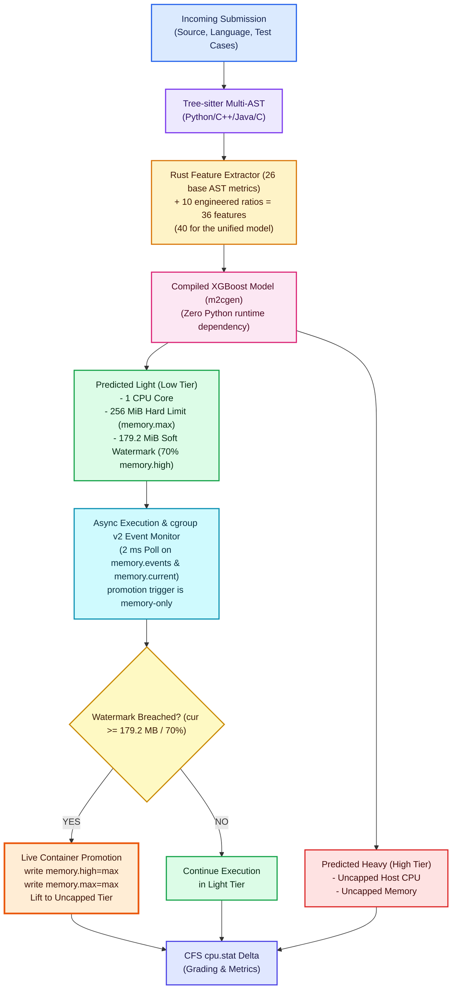

# RAAS-OCJS System Architecture

**Resource-Aware Adaptive Scheduling for Online Competitive Judge Systems**

---

## 1. Executive Summary

Traditional Online Judges (e.g., DOMjudge, DMOJ, VJudge) enforce uniform, static sandbox allocations for all submissions regardless of algorithmic behavior. A simple $O(1)$ query is assigned identical resources and cgroup ceilings as an intensive $O(N^3)$ dynamic programming problem. On fixed, self-hosted hardware without cloud elasticity, resource over-allocation throttles concurrency, while under-allocation risks premature OOM kills.

**RAAS-OCJS** introduces a two-stage adaptive scheduling architecture:
1. **Predictive Phase**: Static source code parsing via Tree-sitter and feature extraction — 26 base AST metrics + 10 engineered ratios = 36 features for the specialised per-language models, 40 for the unified model — fed into a Rust-embedded XGBoost classifier to select an initial isolation tier prior to container instantiation.
2. **Reactive Phase**: Continuous event-driven Linux cgroup v2 monitoring via kernel `memory.events` (specifically the `high` pressure event) and `memory.current` watermarks, dynamically migrating and scaling container resource ceilings live on-the-fly without aborting execution.



                                 

---

## 2. Core Subsystems

### 2.1 Feature Extraction Pipeline (`feature-extraction-pipeline/`)
Built with Rust and Tree-sitter bindings for multi-language AST extraction:
- **Base AST Features (26)**:
  - Loop topology: `nesting_depth`, `max_loop_depth`, `total_loops`.
  - Complexity: `cyclomatic_complexity`.
  - Recursion: `is_recursive`, `recursive_call_count`.
  - Memory markers: `large_alloc_flag` (boolean, derived from the measured allocation aggregate via `AllocStats.any_large()` so its semantics are unchanged), `alloc_size_max`, `alloc_size_total`, `alloc_sites`, `alloc_unknown_sites`, `total_subscripts`, `total_2d_subscripts`.
  - Library markers: `has_heavy_datastructure` (e.g. `unordered_map`, `priority_queue`, `defaultdict`), `has_fast_io`, `has_modulo_arithmetic`, `has_bitmask_ops`, `has_graph_adjacency`.
  - Code scale: `ast_node_count`, `ast_depth`, `source_loc`, `source_chars`, `max_integer_constant`, `total_functions`, `total_calls`, `total_arithmetic_ops`.
- **Engineered Features (10)**:
  - Densities and interaction ratios: `loop_density`, `call_density`, `subscript_density`, `branch_density`, `arithmetic_density`, `subscript_2d_ratio`, `recursion_intensity`, `log_max_constant`, `log_ast_nodes`, `log_source_chars`.

The four `alloc_*` features are **measured aggregates, not booleans**: `alloc_size_max` is the largest single statically-known allocation size at any recognised site, `alloc_size_total` sums those sizes across all sites, `alloc_sites` counts recognised allocation sites, and `alloc_unknown_sites` counts sites whose size is only known at runtime. Their **units differ by language** — C `malloc`/`calloc` sizes are bytes, whereas Java/Python `new T[n]` and container capacities are element counts — which is why the fields are named `size_max`/`size_total` rather than `bytes_max`. They are deliberately not described as bytes.

### 2.2 Embedded Inference Engine (`server/src/predict.rs`)
To keep evaluation latency low and to avoid any Python runtime overhead:
- Offline models are trained with Python and scikit-learn/xgboost on **measured-memory labels**. The current corpus is `model-training/codenet_subset` (IBM Project CodeNet, `iNeil77/CodeNet` on HuggingFace): 164,686 submissions, 737 MB, spanning 2,520 unique problems, labelled Light < 25 MiB / Heavy >= 100 MiB with the ambiguous 25–100 MiB band dropped rather than guessed. The earlier data era is a DeepMind CodeContests subset (`model-training/codecontests_subset`: 30,000 files — Java/Python/C++, 10,000 each, 5,000 Light + 5,000 Heavy per language) whose Light/Heavy labels are a length/difficulty heuristic, not a measurement; source length explains only 7–18% of the variance of measured memory, which is why the label change was necessary. Allocation is now captured by four measured aggregates (`alloc_size_max`, `alloc_size_total`, `alloc_sites`, `alloc_unknown_sites`, see §2.1) in addition to the boolean `large_alloc_flag`, which is derived from them.
- Models are transpiled into pure Rust code via `m2cgen` (`server/src/generated/`). Only the Python, C++, Java, and unified multi-language models are routed, with calibrated decision thresholds ($0.200$ to $0.346$, unified $0.319$). Because the judge consumes these compiled modules, the feature counts (36 specialised / 40 unified) are hardcoded in **four unconnected places** — `server/src/predict.rs`, `model-training/train_advanced_xgboost.py`, `model-training/regenerate_models.sh`, and the generated Rust under `server/src/generated/`; they cannot see each other. `regenerate_models.sh` verifies each trained model's own `num_features()` and refuses on mismatch rather than writing a stale artifact set.
- **C submissions are scored by the unified multi-language model** at $\tau = 0.319$ (`THRESHOLD_UNIFIED`). A C-specialised model is trained and exported, but `predict.rs` does not route through it, so that artifact is unused and no C-specific classifier is in service. C is data-limited (only 428 Heavy examples in the 12.7M-row CodeNet scan, median C memory 0.6 MiB). Re-sync these thresholds from `model-training/artifacts/model_comparison.csv` after every retrain.
- The judge evaluates model inference on the hot path without spawning subprocesses or loading weights dynamically. (Inference latency: UNVERIFIED - needs measurement.)
- **Known limitations.** As a purely static classifier, this stage can both under- and over-estimate resources: input-dependent allocations (e.g. `bytearray(variable)`) are invisible to `const_eval()`, while idiomatic-but-small code (`defaultdict`, `heapq`) reads as Heavy. Both error directions, their shared root cause, and their mitigation by the reactive path are to be measured under [`docs/TEST_PLAN.md`](TEST_PLAN.md) E5.

### 2.3 Container Isolation & Kernel cgroup v2 (`server/src/docker.rs`, `server/src/moderator.rs`)
Submissions run inside dedicated rootless/daemon sandboxes utilizing Linux cgroup v2:
- **Directory Resolution**: Locates `/sys/fs/cgroup/system.slice/docker-<CONTAINER_ID>.scope/` directly on the Linux host filesystem.
- **Low-Tier Launch Flags**: `--cpus=1 --memory=256m --memory-swap=256m`. The hard limit comes from the single source of truth `LOW_MEM_HARD_LIMIT_DEFAULT_MB = 256`; `docker --memory` is derived from it rather than hardcoded. Swap equal to memory is deliberate: with `--memory` set and `--memory-swap` omitted, Docker defaults swap to the same value and the container can draw ~2x nominal from RAM+swap.
- **Tier-Derived JVM Heap**: `-Xmx` is derived from the tier, not hardcoded — 75% of the Low hard limit (192m) in Low, 2x Low (512m) in High, plus `-XX:+UseSerialGC`. A previously hardcoded `-Xmx512m` inside a 256 MiB container produced OOM kills.
- **Per-Test-Case Wall Guard**: `CASE_TIMEOUT` = 10 s; a case exceeding it is killed and graded `TLE`.
- **Dual Memory Boundaries**:
  - `memory.max`: Hard OOM limit (256 MiB for Light tier).
  - `memory.high`: Soft watermark set to 179.2 MiB (`HIGH_WATERMARK_PCT = 70`, i.e. 70% of `memory.max`). Docker sets `memory.max` but not `memory.high`, so the judge writes it. When breached, the kernel throttles memory allocations and increments `memory.events (high)`, allowing the monitor to safely promote the container *before* an OOM killer terminates it.
- **Microsecond Kernel CPU Accounting**:
  - Direct reading of `usage_usec` from `cpu.stat` before and after each test case execution:
    $$\Delta \text{CPU} = \frac{U_{\text{after}} - U_{\text{before}}}{1000} \text{ ms}$$
    where $U$ is the `usage_usec` counter at each sample.
  - Completely excludes Docker CLI, containerd, and runc process invocation latency, delivering stable, deterministic metrics across runs.

### 2.4 Reactive Monitor & Live Tier Migration (`server/src/moderator.rs`)
- Polling loop runs on a 2 ms tick (`MONITOR_POLL`).
- Reads monotonic `memory.events` delta and `memory.current`.
- The trigger is **memory-only**: the monitor watches the `memory.events` `high` counter and `memory.current`. A purely CPU-bound submission is never promoted.
- On watermark breach (`cur >= 179.2MB` / 70% or `high_crossed`), the moderator promotes the container **in place** by writing the unlimited token to the host cgroup files, then issues `docker update` so the daemon's own accounting agrees:
  ```rust
  cg.promote_to_unlimited()?;              // memory.high=max; memory.max=max   (authoritative)
  Command::new("docker")
      .args(["update", container, "--memory", "0", "--memory-swap", "-1", "--cpus", "0"])
      .output()
      .await?;                             // keep the Docker daemon's view in sync
  ```
  > If the host cgroup directory is **not** directly reachable (e.g. Docker Desktop inside a VM), the judge degrades to a fallback that samples `memory.current` via `docker exec` and relies on `docker update` alone.
- The container transitions from **Light (256 MiB)** to **Heavy (Uncapped)** mid-execution without dropping open file descriptors, child PIDs, or execution state. (Transition latency: UNVERIFIED - needs measurement.)
- **Host Privileges & Delegation**: Because writing to `/sys/fs/cgroup/system.slice/docker-<id>.scope/memory.high` touches systemd-managed kernel cgroup controllers, the judge server process must be run with root / sudo permissions (`sudo ./target/debug/server`) or systemd slice delegation. Running without root results in `Permission denied (os error 13)` and suppresses pressure event generation, preventing live promotion.

---

## 3. Data Flow & Communication

1. **Client Submission (`POST /submit`)**:
   - Accepts JSON containing code, language, chosen strategy (`baseline`, `predictive`, `reactive`, `hybrid`), and test cases.
2. **Asynchronous Dispatcher Queue (`server/src/queue.rs`)**:
   - Tokio `mpsc` channel with concurrency bounded by an `Arc<Semaphore>` (max 16 concurrent submissions).
3. **Execution & Metrics Packaging**:
   - Returns structured `JudgeResult` containing:
     - `verdict` (`AC`, `WA`, `RE`, `TLE`, `MLE`, `SE`)
     - `cpu_time_ms` (CFS kernel CPU delta)
     - `wall_time_ms` (total elapsed wall-clock time)
     - `peak_memory_bytes` (maximum RSS sampled)
     - `allocated_memory_bytes` (allocated limit: 256MB or Uncapped)
     - `tier_started` & `tier_promoted`
     - `promotion_time_ms` (exact timestamp when live migration took place)
     - Per-test-case breakdown.

---

> **Security note**: the judge binds `0.0.0.0:3000` with **no authentication** and executes untrusted submitted code. Never expose it publicly; run it only on an isolated host or network.
