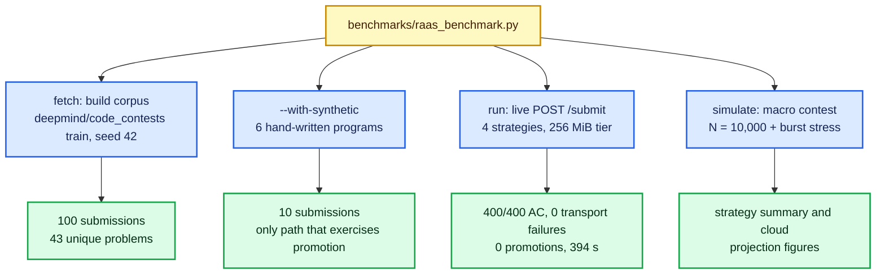

# Benchmark Problem Suite

The RAAS-OCJS benchmark suite is the measured corpus behind the figures in
[`EXPERIMENTAL_RESULTS.md`](EXPERIMENTAL_RESULTS.md): real competitive
programming submissions streamed from **`deepmind/code_contests`** (100
submissions, 100% `CODEFORCES`), optionally supplemented by a small set of
hand-written programs under `--with-synthetic`.

The suite is driven by a single entry point,
[`benchmarks/raas_benchmark.py`](../benchmarks/raas_benchmark.py), which
supersedes the removed `benchmarks/run_codenet_benchmarks.py`. Nothing in this
document is hand-written: every count below was produced by the harness and is
stored under `benchmarks/dataset/` and `benchmarks/results/`.

---

## Harness

`benchmarks/raas_benchmark.py` is the single test entry point. Subcommands:

| Subcommand | Purpose |
|---|---|
| `preflight` | Check the judge, images, cgroup mode and dependencies |
| `probe` | Verify the five verdicts against ground truth |
| `fetch` | Build the corpus into `benchmarks/dataset/` |
| `run` | Live runs against the judge (one `POST /submit` per submission x strategy) |
| `simulate` | Macro contest simulation plus burst stress |
| `all` | `fetch` → `run` → `simulate` |
| `status` | Report what is currently on disk |

**Layout.** The corpus lives in `benchmarks/dataset/` as a `manifest.json` plus
a `sources/` directory of raw submission files. Results are written to
`benchmarks/results/*_tier256.csv`:

- `real_dataset_empirical_runs_tier256.csv` — one row per live run
- `real_dataset_strategy_summary_tier256.csv`
- `real_dataset_language_metrics_tier256.csv`
- `real_dataset_cloud_projection_tier256.csv`
- `real_dataset_burst_stress_tier256.csv`

**Tier suffix.** Output filenames are *always* suffixed with the tier that
produced them. The removed harness wrote unsuffixed names holding whichever
tier ran last — which is how 128 MiB figures came to be cited as the shipped
configuration. Any figure should be traced to its `_tier256` file.

**Knobs.** `JUDGE_URL`, `LIGHT_TIER_MB`, `BENCH_SEED`, `--count`,
`--with-synthetic`, `--langs-per-problem`, `--max-candidates`, and
`--validate-cases` (0 = validate on every case the run will use).

---

## Corpus

Built by `fetch` from `deepmind/code_contests`, split `train`, seed 42. Each
candidate is validated against the live judge before it is kept.

- **Requested / saved**: 100 / 100 submissions; 24 rejected by validation; all
  saved submissions validated; 5 test cases each; 43 unique problems.
- **Languages**: cpp 42, python 30, java 28.
- **Origin**: 100% `CODEFORCES`.
- **Case size limits**: each case ≤ 32 KiB, total per submission ≤ 96 KiB.
- **Input sizes**: min 26 B, max 975 B, mean 267 B.

**Program types** (100 submissions):

| Type | n |
|---|---|
| Brute Force / Simulation | 29 |
| Data Structures | 20 |
| DP / State Table | 16 |
| Graph / Trees | 12 |
| Number Theory / Math | 10 |
| Greedy / Sorting | 9 |
| Bitmask / Bits | 4 |

**Difficulty** (code_contests letters): A 20, B 19, E 19, D 18, C 12, F 9,
J 2, G 1.

**Python 2 sources are rejected.** CodeContests `language=1` (`PYTHON`) is
largely Python 2, and `print x` is a `SyntaxError` under the judge's Python 3
runtime. The harness drops any candidate that fails `ast.parse`, and orders
candidates within a language so `PYTHON3` (lang 3) is preferred over `PYTHON`
(lang 1).

---

## Synthetic Supplement (`--with-synthetic`)

`--with-synthetic` prepends **6 hand-written programs** to the corpus:

- a heavy knapsack in cpp, python, java and c,
- a light C prefix-sum,
- a CPU-bound C Floyd-Warshall (`S3_floyd_cpu`).

**This is the only way to exercise promotion**, because a pure CodeContests
corpus contains no memory-heavy programs. Run with the synthetic set the suite
totals 10 submissions and 30 s, and records **8/40 promotions**. Run without it
the suite is 100 submissions and records **0/400 promotions** — even though all
400 runs are `AC`. See
[`EXPERIMENTAL_RESULTS.md`](EXPERIMENTAL_RESULTS.md) §2 for that framing, which
matters: the CodeContests corpus alone does *not* demonstrate the adaptive
mechanism.

`S3_floyd_cpu` exists specifically to cover the CPU-bound case: promotion is
triggered by memory pressure only, so a purely CPU-bound submission is never
promoted.

---

## Verdict Probes (`probe`)

`probe` verifies the judge's five verdicts from ground truth. All five pass,
**5/5**: `AC`, `WA`, `RE`, `TLE`, `MLE`.

- **`TLE`**: killed by the 10 s per-case guard; observed ~10.03 s CPU /
  ~10.26 s wall.
- **`MLE`**: starts in the low tier, peaks ~255.5–256.0 MB, and is OOM-killed.

This closes the previously open item recorded in `EXPERIMENTAL_RESULTS.md`
section 5, which noted the `TLE` and `MLE` paths had only ever been exercised
against a build predating them. They have now been re-run and pass.

---

## Routing Evaluation (separate tooling)

The routing figures — the misroute rates, the threshold comparison and the
real-failure decomposition quoted in
[`EXPERIMENTAL_RESULTS.md`](EXPERIMENTAL_RESULTS.md) §4.5 — do **not** come from
this harness and are not stored under `benchmarks/results/`. They are produced by
`model-training/evaluate_routing.py`, which replays the trained models through
the deployed per-language routing rule over a problem-disjoint test split
(**28,687 submissions / 483 problems**, held out from **125,159 train / 1,930
problems**).

Keep the two provenance chains separate when citing: the harness measures
execution-engine behaviour (verdicts, promotion, resource use), while
`evaluate_routing.py` measures classifier routing quality (misroute rate and
AUC). The frontend consumes neither: `frontend/src/App.tsx` calls only `/health`
and `/submit`.

---

## Legacy Interactive Fixtures

`frontend/src/problems.ts` still ships five hand-written fixtures for the web
UI:

- **P1: Range Prefix Sums & Cumulative Balance** — O(N + Q) Time · O(N) Space
- **P2: 0-1 Knapsack Large State Space (2D Grid DP)** — O(N × W) Time · O(N × W) Space
- **P3: All-Pairs Shortest Path (Floyd-Warshall Algorithm)** — O(V³) Time · O(V²) Space
- **P4: Game Tree Search (Binary Branching Recursion)** — O(2ⁿ) Time · O(N) Stack Depth
- **P5: Top-K Streaming Frequencies (Hash Map + Priority Queue)** — O(N log K) Time · O(N) Space

These are UI fixtures, not the measurement corpus, and their per-case time and
memory figures are `UNVERIFIED - needs measurement`: the five-fixture matrix
quoted in earlier drafts of this document came from the superseded harness whose
outputs were not tier-suffixed, and it is not reproduced in the 2026-09-30
record.
