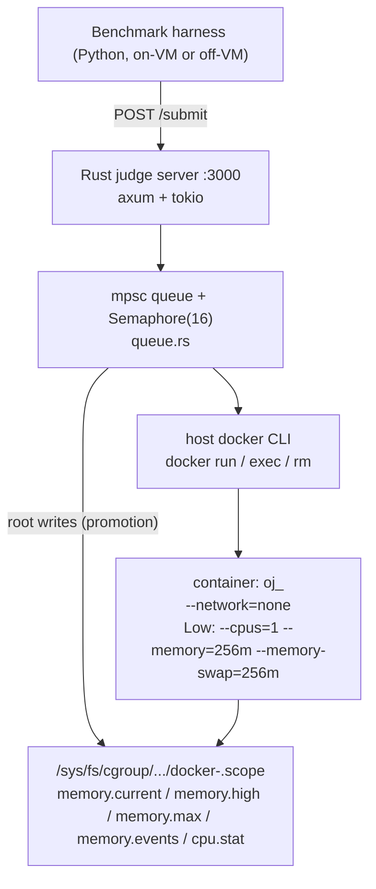
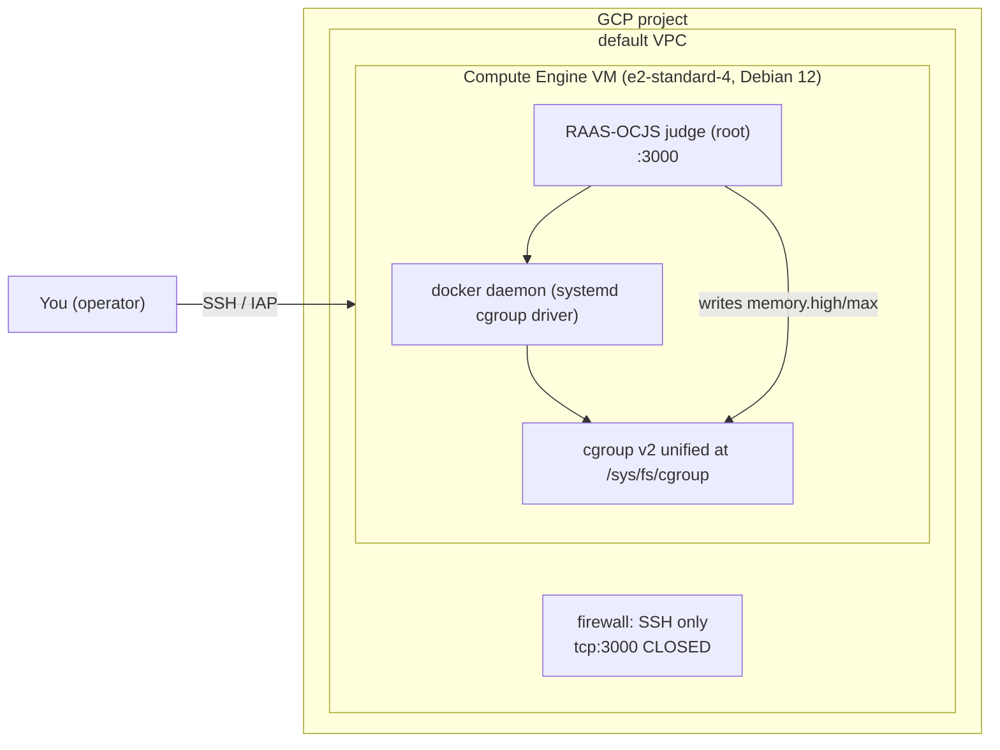

# RAAS-OCJS on Google Cloud Platform — Deployment Plan and Technical Review

**Purpose.** A deployment-architect review answering: *given this exact repository and its current
architecture, how should RAAS-OCJS be deployed on GCP, what resources should be used, what should
they be configured with, and what exactly should be run to perform a scientifically useful
50–100 submission experiment?*

This document is written to be executed manually by the operator. It does **not** create any GCP
resource and does **not** require any code change to deploy the committed system.

**Provenance conventions used throughout.**

- **[FOUND]** — read directly out of the repository, with a `file:line` citation.
- **[ASSUMPTION]** / **[JUDGEMENT]** — the reviewer's reasoning, not a repository fact.
- **[APPROX]** — a price or figure that must be re-verified; provider prices change and could not
  be queried live.

**Context.** This work responds to peer-review feedback that (a) the AWS cost figures are projected
rather than measured, (b) the 10,000-submission evaluation is simulated from only ~72 real
executions, and (c) all physical experiments came from a single bare-metal testbed.

---

## Table of Contents

1. [Current RAAS-OCJS architecture](#1-current-raas-ocjs-architecture)
2. [Recommended GCP architecture](#2-recommended-gcp-architecture)
3. [Exact GCP resource to create](#3-exact-gcp-resource-to-create)
4. [Recommended VM specifications](#4-recommended-vm-specifications)
5. [Why this configuration](#5-why-this-configuration)
6. [OS / Docker / cgroups requirements](#6-os--docker--cgroups-requirements)
7. [Manual deployment procedure](#7-manual-deployment-procedure)
8. [How to perform the 50–100 submission experiment](#8-how-to-perform-the-50100-submission-experiment)
9. [Metrics to collect](#9-metrics-to-collect)
10. [Expected output/artifacts](#10-expected-outputartifacts)
11. [Repository changes required](#11-repository-changes-required)
12. [Potential problems and troubleshooting](#12-potential-problems-and-troubleshooting)
13. [What this experiment lets us claim](#13-what-this-experiment-lets-us-claim)
14. [What limitations remain](#14-what-limitations-remain)

---

# 1. Current RAAS-OCJS architecture

## 1.1 Topology — one Rust binary, shelling out to the host Docker CLI

**[FOUND]** The whole server is a single Tokio/Axum binary ([`server/src/main.rs`](../server/src/main.rs:81)).
There is no Python at runtime, no database, no message broker, no external service. It binds
`0.0.0.0:3000` with `CorsLayer::allow_origin(Any)` and **no authentication**
([`server/src/main.rs`](../server/src/main.rs:97)). A startup probe runs `docker info` and aborts if
Docker is unavailable ([`server/src/main.rs`](../server/src/main.rs:89)). If `/var/run/docker.sock`
exists it forces `DOCKER_CONTEXT=default` in-process ([`server/src/main.rs`](../server/src/main.rs:84)).



**[FOUND]** Concurrency is capped by an `Arc<Semaphore>` of 16 with an mpsc buffer of 100
([`server/src/queue.rs`](../server/src/queue.rs:10)). Each request is one submission; the handler
holds the connection open until the verdict is produced.

## 1.2 Prediction / model components

**[FOUND]** Models are **pre-compiled into Rust** by `m2cgen` and live in
[`server/src/generated/`](../server/src/generated/unified_multi_language.rs) —
`specialized_python.rs`, `specialized_cpp.rs`, `specialized_java.rs`,
`unified_multi_language.rs`. They are wired in by [`server/src/predict.rs`](../server/src/predict.rs:15)
and selected per language at [`server/src/predict.rs`](../server/src/predict.rs:125).
**C routes through the unified model**, not a C model ([`server/src/predict.rs`](../server/src/predict.rs:129)).
Thresholds are hard constants ([`server/src/predict.rs`](../server/src/predict.rs:25)): unified 0.319,
cpp 0.346, java 0.257, python 0.200. Feature vectors are 36 (specialised) / 40 (unified) and their
lengths are asserted in a unit test ([`server/src/predict.rs`](../server/src/predict.rs:150)).

## 1.3 Feature extraction & AST processing

**[FOUND]** Tree-sitter extraction is a separate Rust crate, `feature-extraction`, pulled in as a
path dependency ([`server/Cargo.toml`](../server/Cargo.toml:10),
[`feature-extraction-pipeline/Cargo.toml`](../feature-extraction-pipeline/Cargo.toml:15)) with
grammars `tree-sitter-{c,cpp,python,java}` `0.20`. `predict_tier()` calls
`compute_features(source, lang)` on the hot path ([`server/src/predict.rs`](../server/src/predict.rs:122))
— in-process, no subprocess. There is also a standalone binary `OJ-feature-extraction-spike` for
offline corpus labelling, and a `probe.rs` diagnostic that just dumps parse trees
([`feature-extraction-pipeline/src/bin/probe.rs`](../feature-extraction-pipeline/src/bin/probe.rs:1)).

## 1.4 Submission processing, scheduling, resource allocation

**[FOUND]** Flow per submission: `predict_tier()` (policy-dependent) → `run_submission()`
([`server/src/docker.rs`](../server/src/docker.rs:439)) → write source to `/tmp/oj_<sanitised-id>/` →
`docker run -d --network=none` with tier flags → `docker cp` the source in → compile **inside the
container** (`g++`/`gcc`/`javac`) ([`server/src/docker.rs`](../server/src/docker.rs:611)) →
`locate_cgroup_dir()` → arm `memory.high` if the policy can promote → run each test case with
`docker exec -i` while polling in parallel → `docker rm -f`.

Tier flags ([`server/src/docker.rs`](../server/src/docker.rs:147)): Low =
`--cpus=1 --memory=256m --memory-swap=256m`; High = **no flags at all** (uncapped). The 256 MiB comes
from `LOW_MEM_HARD_LIMIT_DEFAULT_MB` at [`server/src/docker.rs`](../server/src/docker.rs:18), and is
overridable by the env var `LOW_TIER_MB` at [`server/src/docker.rs`](../server/src/docker.rs:24).
`--memory-swap` equal to `--memory` is deliberate (no swap headroom). Java heap is tier-derived:
75% of Low = 192m in Low, 2× Low = 512m in High, with `-XX:+UseSerialGC`
([`server/src/docker.rs`](../server/src/docker.rs:174)). Per-case wall guard is 10 s
([`server/src/docker.rs`](../server/src/docker.rs:194)).

Policies ([`server/src/policy.rs`](../server/src/policy.rs:48)): Baseline → always High, never
promotes; Predictive → classifier, never promotes
([`server/src/policy.rs`](../server/src/policy.rs:62)); Reactive → always Low, promotes on watermark
([`server/src/policy.rs`](../server/src/policy.rs:74)); Hybrid → predictive start + reactive
correction ([`server/src/policy.rs`](../server/src/policy.rs:150)).

## 1.5 cgroups v2 usage (the load-bearing part)

**[FOUND]** [`server/src/moderator.rs`](../server/src/moderator.rs:1) is a pure file-I/O layer over
`/sys/fs/cgroup` ([`server/src/moderator.rs`](../server/src/moderator.rs:27)). It:

- locates the container's cgroup dir from `/proc/<pid>/cgroup` via `docker inspect`
  ([`server/src/moderator.rs`](../server/src/moderator.rs:192)), with a fallback across
  `/system.slice/docker-<id>.scope`, `/docker-<id>.scope`, `/docker/<id>`, `/<id>`;
- reads `memory.events` (`high`, `oom_kill`), `memory.current`, `memory.peak`, `cpu.stat`
  (`usage_usec`) ([`server/src/moderator.rs`](../server/src/moderator.rs:61));
- **writes** `memory.high` ([`server/src/moderator.rs`](../server/src/moderator.rs:111)), and on
  promotion writes `max` to both `memory.high` and `memory.max`
  ([`server/src/moderator.rs`](../server/src/moderator.rs:136)), then
  `docker update <c> --memory 0 --memory-swap -1 --cpus 0` to keep the daemon in sync
  ([`server/src/docker.rs`](../server/src/docker.rs:312)).

Watermark = 70% of the low tier = 179.2 MiB ([`server/src/docker.rs`](../server/src/docker.rs:21),
[`server/src/docker.rs`](../server/src/docker.rs:46)); the monitor ticks every 2 ms
([`server/src/docker.rs`](../server/src/docker.rs:55)). CPU time is a `cpu.stat` `usage_usec` delta,
not wall clock ([`server/src/docker.rs`](../server/src/docker.rs:394)). MLE is read from a per-case
`oom_kill` counter delta ([`server/src/docker.rs`](../server/src/docker.rs:415)). If the host cgroup
dir is unreachable, the judge degrades to a `docker exec cat /sys/fs/cgroup/memory.current` fallback
with **no MLE detection** ([`server/src/docker.rs`](../server/src/docker.rs:329)).

**[FOUND — critical privilege requirement]** Writing `memory.high` under
`/sys/fs/cgroup/system.slice/...` requires root. The docs are explicit that without `sudo` the kernel
returns `Permission denied (os error 13)`, pressure events never fire, and **reactive promotion
silently never happens** ([`server/README.md`](../server/README.md:82),
[`docs/SETUP_GUIDE.md`](SETUP_GUIDE.md:44)). The containers themselves are **not** privileged and
need no extra capabilities — only `--network=none` and a size limit.

## 1.6 Docker / container execution

**[FOUND]** Three runtime images, all Alpine-based and built locally, all dropping to uid 1000:
`python:3.12-alpine` ([`server/runtimes/python/Dockerfile`](../server/runtimes/python/Dockerfile:1)),
`eclipse-temurin:17-jdk-alpine` ([`server/runtimes/java/Dockerfile`](../server/runtimes/java/Dockerfile:1)),
`alpine:3.19 + g++ + gcc + musl-dev` ([`server/runtimes/cpp/Dockerfile`](../server/runtimes/cpp/Dockerfile:1)).
Images are resolved by name ([`server/src/docker.rs`](../server/src/docker.rs:57)). The judge shells
out to the `docker` CLI for every operation — there is no Docker API client.

## 1.7 Workload generation & benchmark programs

**[FOUND]** Two distinct offline corpora:

- **Model-training corpora** (`model-training/`): CodeContests subset (heuristic labels) and CodeNet
  subset (measured-memory labels, 164,686 submissions / 2,520 problems). These are **not committed**
  (`.gitignore` only ignores `__pycache__`; the data was never added).
- **Benchmark corpus** ([`benchmarks/dataset/`](../benchmarks/dataset/manifest.json)): **committed**,
  self-contained. `manifest.json` meta says `requested_count: 100`, `saved_count: 100`,
  `validated: true`, `with_synthetic: false`, seed 42
  ([`benchmarks/dataset/manifest.json`](../benchmarks/dataset/manifest.json:6)), and **each submission
  entry embeds its test cases**. 100 raw sources are committed under `benchmarks/dataset/sources/`.
  So the 100-submission experiment needs **no HuggingFace access, no `datasets` package, and no
  network** at run time. This is the single most important practical fact for the GCP plan.
- **Synthetic programs** are defined in code, not on disk: `synthetic_programs()`
  ([`benchmarks/raas_benchmark.py`](../benchmarks/raas_benchmark.py:773)) returns 6 programs = heavy
  2D knapsack in cpp / python / java / c, a light C prefix-sum, and a CPU-bound C Floyd-Warshall.
  They are only injected during `fetch`.

## 1.8 Logging / measurement infrastructure

**[FOUND]** Measurement is entirely cgroup-derived: `peak_memory_bytes` = max sampled
`memory.current`; `cpu_time_ms` = `cpu.stat` delta; `allocated_memory_bytes` = 256 MiB or 0
(uncapped) ([`server/src/models.rs`](../server/src/models.rs:12)). The response also carries
`tier_started`, `tier_promoted`, `promotion_time_ms`, and a per-case array. **The classifier's
probability/score is never exposed.** Server diagnostics go to stdout/stderr as `eprintln!` (e.g.
`[moderator] failed to arm memory.high ...`,
[`server/src/docker.rs`](../server/src/docker.rs:471)) — these are the only evidence that cgroup
writes succeeded, so they must be captured.

## 1.9 Dependencies / local services

**[FOUND]** Runtime: Linux + cgroup v2 + native Docker daemon + the three images. Build: Rust
(edition 2024 → rustc 1.85+, [`server/Cargo.toml`](../server/Cargo.toml:4)), a C compiler for the
tree-sitter grammars. Harness: Python 3 + `requests` for `run`/`probe`/`status`; `datasets` only for
`fetch`/`preflight` ([`model-training/requirements.txt`](../model-training/requirements.txt:1)).
No local databases or services.

## 1.10 How the 10,000-submission simulation works

**[FOUND]** [`benchmarks/raas_benchmark.py`](../benchmarks/raas_benchmark.py:1155) is a **pure
discrete-event queue simulator in Python**. It:

1. reads the measured per-run CSV via `load_empirical()`
   ([`benchmarks/raas_benchmark.py`](../benchmarks/raas_benchmark.py:1069));
2. builds a profile dict keyed by `(problem_id, language, strategy)`;
3. generates N=10,000 non-homogeneous Poisson arrivals over 7,200 s
   ([`benchmarks/raas_benchmark.py`](../benchmarks/raas_benchmark.py:1170));
4. samples a profile per submission with ±3% jitter
   ([`benchmarks/raas_benchmark.py`](../benchmarks/raas_benchmark.py:1099));
5. runs an M/G/K FIFO queue with slot counts derived from **hardcoded** `HOST_SPECS`
   ([`benchmarks/raas_benchmark.py`](../benchmarks/raas_benchmark.py:124)): usable = 15360−1024 MiB;
   baseline slots = floor(14336/2048) = 7; adaptive = floor(14336/256) = 56
   ([`benchmarks/raas_benchmark.py`](../benchmarks/raas_benchmark.py:1199));
6. charges memory via `alloc_for()` — 256 if started low, 2048 if started high **or promoted**
   ([`benchmarks/raas_benchmark.py`](../benchmarks/raas_benchmark.py:949));
7. writes the summary, per-language, cloud-projection and burst CSVs
   ([`benchmarks/raas_benchmark.py`](../benchmarks/raas_benchmark.py:1217)).

The cloud projection is analytic arithmetic over two constants — `BASELINE_TIER_MB = 2048` and
`CLOUD_INSTANCE = AWS c6i.4xlarge @ USD 0.68/hr`
([`benchmarks/raas_benchmark.py`](../benchmarks/raas_benchmark.py:108),
[`benchmarks/raas_benchmark.py`](../benchmarks/raas_benchmark.py:139)). **No cloud resource is
contacted at any point.** Same for burst stress
([`benchmarks/raas_benchmark.py`](../benchmarks/raas_benchmark.py:1342)).

## 1.11 Where the "72 real executions" came from

**[FOUND, documented] — 72 = 18 programs × 4 strategies**
([`docs/FINAL_RESULTS.md`](FINAL_RESULTS.md:52),
[`docs/CONFERENCE_EVALUATION_REPORT.md`](CONFERENCE_EVALUATION_REPORT.md:308)), on the 256 MiB tier,
driven through the same `POST /submit` path. A 128 MiB re-run of the same 72 cells is in the report
§9 ([`docs/CONFERENCE_EVALUATION_REPORT.md`](CONFERENCE_EVALUATION_REPORT.md:528)).

**[FOUND] Provenance of the artifacts, which is messier than the docs imply:**

- The committed measured file is **not** a 72-run file. It is
  `benchmarks/results/real_dataset_empirical_runs_tier256.csv` with **401 data rows** (402 lines
  incl. header) = 100 submissions × 4 strategies, all `AC`, **0 promotions**
  ([`docs/EXPERIMENTAL_RESULTS.md`](EXPERIMENTAL_RESULTS.md:32),
  [`docs/EXPERIMENTAL_RESULTS.md`](EXPERIMENTAL_RESULTS.md:57)). Its
  `judge_url_used_for_validation` was a Tailscale IP
  ([`benchmarks/dataset/manifest.json`](../benchmarks/dataset/manifest.json:14)).
- There is a third, older artifact — [`benchmarks/laptop_matrix_80run.json`](../benchmarks/laptop_matrix_80run.json:1),
  an 80-cell (20 programs × 4 strategies) matrix keyed `"<n>|<Lang>|<strategy>"` =
  `[verdict, tier_started, promoted, promo_ms, peak_mb, cpu_ms]`.
- **The 18-program corpus that produced the 72 runs is not in the repo**, and no script reproduces
  exactly 72 runs. So the 72-run table is documented but **not reproducible from the current tree**
  without recreating that corpus.
- **The 72-run table is stale relative to the deployed build.** It reports Java-on-knapsack as `MLE`
  at 255–256 MB ([`docs/FINAL_RESULTS.md`](FINAL_RESULTS.md:59)) under a hardcoded `-Xmx512m`; the
  shipped code now derives the heap from the tier ([`server/src/docker.rs`](../server/src/docker.rs:174))
  and the post-fix synthetic Java result is `RE` at ~202 MB
  ([`docs/EXPERIMENTAL_RESULTS.md`](EXPERIMENTAL_RESULTS.md:81)).
- **Open inconsistency you should know about before writing the rebuttal.** The committed CSVs say
  Reactive reserves **2,500 GB / 87.5% saved with 0 promotions**
  ([`benchmarks/results/real_dataset_strategy_summary_tier256.csv`](../benchmarks/results/real_dataset_strategy_summary_tier256.csv:4)),
  while [`docs/CONFERENCE_EVALUATION_REPORT.md`](CONFERENCE_EVALUATION_REPORT.md:58) says
  **10,557 GB / 47.22% saved with 2,032 promotions (20.3%)**. Both claim to be the same
  10,000-submission, 256 MiB experiment. The repo itself flags this as unresolved and says do not
  cite both ([`docs/EXPERIMENTAL_RESULTS.md`](EXPERIMENTAL_RESULTS.md:170)). A reviewer who read the
  report may be reviewing numbers the committed artifact does not support.

---

# 2. Recommended GCP architecture

**Recommendation: one Compute Engine VM, native Docker on the host, judge running as root. Nothing
else.**

This is not a "cloud-native" architecture, and that is the correct choice — the system's scientific
contribution *is* host-kernel cgroup v2 manipulation of sibling container scopes, so the deployment
must preserve exactly that.

| Option | Verdict |
|---|---|
| **Compute Engine VM** | **[JUDGEMENT] Recommended.** Full VM, own kernel, root, real `/sys/fs/cgroup`, native Docker daemon, per-container `system.slice/docker-<id>.scope`. Preserves every mechanism 1:1. |
| Cloud Run | **Unsuitable.** No Docker daemon and no way to create sibling containers; sandboxed runtime (gVisor) with no host `/sys/fs/cgroup` write access; no persistent locally built images from [`server/runtimes/*`](../server/runtimes/cpp/Dockerfile:1); no root. The Reactive/Hybrid paths would be dead and `locate_cgroup_dir()` would fail. |
| GKE Autopilot | **Unsuitable.** No privileged pods, no hostPath to `/sys/fs/cgroup`, no hostPID, no access to the node's Docker daemon. Also cannot write to sibling container scopes. |
| GKE Standard | **Technically possible, not recommended.** Requires privileged pods + hostPID + hostPath `/sys/fs/cgroup` + Docker-in-Docker; the judge would have to reach the *node's* container scopes from inside a pod whose own cgroup is a child of the node's — cgroup delegation makes `memory.high` writes fragile, and DinD changes the cgroup layout that [`server/src/moderator.rs`](../server/src/moderator.rs:192) probes. It buys you nothing for a single-VM experiment and adds a class of failure modes that would themselves be reviewable. |
| Multiple VMs / GKE cluster | **Out of scope.** The paper's claims are node-level (packing density, reserved RAM). A multi-node experiment would test a distributed scheduler the repo does not contain. The server has no inter-node coordination. |



---

# 3. Exact GCP resource to create

**Compute Engine → VM instances → Create instance.** Concretely:

| Field | Value |
|---|---|
| Name | `raas-ocjs-gcp` |
| Region / Zone | `us-central1` / `us-central1-a` (see §5 for the trade-off) |
| Machine family | General purpose → **E2** |
| Machine type | **`e2-standard-4`** — 4 vCPU / 16 GB (minimum practical: `e2-standard-2`, 2 vCPU / 8 GB) |
| CPU platform | Default (do not pin; not scientifically relevant) |
| Boot disk OS | **Debian GNU/Linux 12 (bookworm)**, x86/64 |
| Boot disk type / size | **pd-balanced, 30 GB** |
| Firewall | Allow SSH (22) **only from your IP**; leave HTTP/HTTPS unchecked |
| Network | default VPC; ephemeral external IPv4 (needed for apt/Docker Hub) |
| Service account | default compute SA, no extra scopes (VM needs no GCP API access) |
| Provisioning | on-demand (Spot is ~60–70% cheaper but can preempt mid-run) |

That is the entire resource list. Enabled API: **Compute Engine API** (`compute.googleapis.com`)
only.

---

# 4. Recommended VM specifications

| Resource | Recommended | Minimum that works | Why |
|---|---|---|---|
| vCPU | 4 (E2 standard, non-burstable) | 2 | The harness is **sequential** (one `POST /submit` at a time, [`benchmarks/raas_benchmark.py`](../benchmarks/raas_benchmark.py:984)) and the server caps concurrency at 16 ([`server/src/queue.rs`](../server/src/queue.rs:10)). vCPU count is **not** scientifically important here; core *quality* is (avoid burstable/shared-core, which throttles and inflates wall time). |
| RAM | 16 GB | 8 GB | Important as an order of magnitude only: Low tier is 256 MiB and High is uncapped, with g++ peaking 189–211 MB ([`docs/FINAL_RESULTS.md`](FINAL_RESULTS.md:87)) and the heavy knapsack ~203 MB. 8 GB is ample; 16 GB additionally reproduces the 15 GiB class of the reference testbed, which makes the prose comparison natural. Note: **the simulation's slot counts do not read VM RAM** (§1.10), so extra RAM does not change any reported figure. |
| Disk | 30 GB pd-balanced | 20 GB | Rust toolchain+registry ~1.5 GB, `cargo` target dir ~1–2 GB, Docker images ~0.8 GB, repo ~0.2 GB. |
| CPU architecture | **x86/64 (AMD64)** | — | **[FACT]** Docker images are `alpine`/`temurin` multi-arch, and tree-sitter 0.20 grammars build on either arch — but the C++ compile-memory measurements (189–211 MB) and all reference timings were taken on x86-64. ARM would add an unquantified variable for zero benefit. Use AMD64. |
| Daemon/engine | Docker Engine (native, `/var/run/docker.sock`) | Debian `docker.io` works | The judge requires a native daemon so `/sys/fs/cgroup` is reachable ([`server/README.md`](../server/README.md:294)). |
| cgroups | **v2 unified** | required | `stat -fc %T /sys/fs/cgroup` must print `cgroup2fs`; the preflight checks it ([`benchmarks/raas_benchmark.py`](../benchmarks/raas_benchmark.py:1539)). |
| Kernel | any modern GCE Debian 12 kernel | — | Needs `memory.high`, `memory.events`, `cpu.stat` — all present in cgroup v2 since 5.x. |
| Toolchain | rustup, rustc ≥ 1.85 | required | `edition = "2024"` ([`server/Cargo.toml`](../server/Cargo.toml:4)). |

**What is scientifically important vs incidental** (in the original i5-13420H / 12 threads / 15 GiB /
Fedora host):

- **Important:** cgroup v2 unified hierarchy; native Linux Docker with the
  `system.slice/docker-<id>.scope` layout; root privilege for the judge; the 256 MiB tier; the 70%
  watermark; CFS `cpu.stat` accounting; the sequential single-submission drive pattern.
- **Incidental:** the exact CPU model, P-core/E-core split, 12 vs 8 threads, DRAM size, Fedora vs
  Debian, NVMe vs pd-balanced, Docker 29.x vs 27.x. The published claims are about *reserved
  capacity and slot counts*, which are functions of the tier size, not of the host's core count.
- **One genuine caveat [JUDGEMENT]:** every execution time on a GCE VM passes through a hypervisor,
  so wall time and (slightly) CPU time are exposed to vCPU steal and shared-cache effects that the
  bare-metal testbed did not have. That is a real difference — and it is precisely why the paper's
  own §1.3 rationale for doing calibration on bare metal exists
  ([`docs/CONFERENCE_EVALUATION_REPORT.md`](CONFERENCE_EVALUATION_REPORT.md:78)). Treat GCP as a
  *portability/feasibility* environment, not as a replacement calibration environment.

---

# 5. Why this configuration

- **E2 vs N2/C3.** E2 is the cheapest GCP family at this shape. `e2-standard-*` are not shared-core
  ([ASSUMPTION] — verify on the machine-type page), which avoids the burstable-throttling confound.
  If you want per-core performance closer to the i5-13420H P-core, `n2-standard-4` or
  `c3-standard-4` is closer, at roughly 1.5–1.6× the price. Since the claims are about reserved
  memory, not absolute latency, E2 is the right cost/benefit point.
- **Region.** `us-central1` (Iowa) is one of the cheapest GCP regions and has the widest machine-type
  availability. **[JUDGEMENT] Region latency is irrelevant to this experiment**, because the harness
  runs *on the VM* and talks to `127.0.0.1:3000` — no WAN hop is inside any measured number. The only
  reason to pick `asia-south1` (Mumbai, ~1.3–1.5× cost) is your own SSH responsiveness. If you instead
  run the harness from your laptop in India against the VM, you inject ~130 ms RTT into
  `e2e_request_to_verdict_ms` and you should not compare that column to the LAN-calibrated one.
- **Debian 12 over Ubuntu.** Debian 12 defaults to cgroup v2 unified (satisfies
  [`benchmarks/raas_benchmark.py`](../benchmarks/raas_benchmark.py:1539) out of the box), has the
  official Docker apt repo, and is minimal. Ubuntu 22.04/24.04 LTS is an equally fine substitute.
  Container-Optimized OS is **not** recommended: read-only root, no package manager, awkward for a
  Rust build.
- **Billing assumptions (do not rely on these):** **[APPROX]** `e2-standard-4` in `us-central1` lists
  around **USD 0.134/hr** → roughly **USD 0.27 for a 2-hour session**. `e2-standard-4` given 24/7
  month ≈ USD 98. `e2-standard-2` ≈ USD 0.067/hr. `n2-standard-4` ≈ USD 0.19/hr; `c3-standard-4` ≈
  USD 0.21/hr. New accounts typically get a **90-day USD 300 free trial**, which would cover this
  many times over. **[ASSUMPTION]** I cannot see your billing plan; there is nothing in the
  repository that reveals one. There is also an always-free `e2-micro`
  (us-west1/us-central1/us-east1) — **1 GB RAM / shared vCPU, unusable here**. Verify current prices
  in the GCP pricing calculator before budgeting. External IPv4 on a running VM now carries a small
  hourly charge.

---

# 6. OS / Docker / cgroups requirements

**Host requirements ([FOUND], from code and docs):**

| Requirement | Evidence |
|---|---|
| Linux with cgroup **v2 unified** | [`server/src/moderator.rs`](../server/src/moderator.rs:27), preflight check at [`benchmarks/raas_benchmark.py`](../benchmarks/raas_benchmark.py:1539) |
| Native Docker daemon at `/var/run/docker.sock` | [`server/src/main.rs`](../server/src/main.rs:84) |
| Root for the judge process | [`server/src/docker.rs`](../server/src/docker.rs:470), [`docs/SETUP_GUIDE.md`](SETUP_GUIDE.md:42) |
| `sysfs` with a writable `/sys/fs/cgroup` | [`server/src/moderator.rs`](../server/src/moderator.rs:111) |
| `procfs` mounted (`/proc/<pid>/cgroup`) | [`server/src/moderator.rs`](../server/src/moderator.rs:200) |
| `memory` + `cpu` controllers on the unified hierarchy | [`server/src/moderator.rs`](../server/src/moderator.rs:16) |
| Docker CLI on the judge's `PATH` | [`server/src/docker.rs`](../server/src/docker.rs:211) |
| g++/gcc/javac **inside** the runtime images | [`server/src/docker.rs`](../server/src/docker.rs:611) |

**cgroup v2 mechanisms used, explicitly:**

- `memory.max` — set by Docker from `--memory=256m` (268435456 bytes). Hard OOM boundary.
- `memory.high` — **not set by Docker**; written by the judge to 187904819 bytes (= 179.2 MiB) only
  when the policy `can_promote()` and the tier is Low
  ([`server/src/docker.rs`](../server/src/docker.rs:469)). This is what makes `memory.events` `high`
  fire.
- `memory.events` — `high` counter is the reactive trigger
  ([`server/src/docker.rs`](../server/src/docker.rs:302)); `oom_kill` counter delta is the MLE verdict
  ([`server/src/docker.rs`](../server/src/docker.rs:415)).
- `memory.current` — sampled every 2 ms as the peak-RSS estimator
  ([`server/src/docker.rs`](../server/src/docker.rs:322)).
- `cpu.max` — set by Docker from `--cpus=1` (expect `100000 100000`). `set_cpu_max()` exists but is
  unused today ([`server/src/moderator.rs`](../server/src/moderator.rs:143)).
- `cpu.stat` `usage_usec` — the CPU-time measurement.
- Promotion writes `max` to both `memory.high` and `memory.max`, then
  `docker update --memory 0 --memory-swap -1 --cpus 0`.
- **No swap**: `--memory-swap=256m` pins swap equal to memory so RAM+swap can't reach ~2×.
- **Namespaces**: each submission is its own container with `--network=none` and its own
  rootfs/PID/mount namespaces, but **without** `--privileged`, `--cap-add`, `--pid=host`, or host
  mounts. The containers are ordinary unprivileged containers; only the *judge process* is
  privileged. Nothing about the design forces the container to be privileged, which is exactly why a
  plain GCE VM is sufficient.

**Can the recommended VM support all of this? Yes** — a GCE VM gives you a real kernel, real
`sysfs`, root, and a native Docker daemon. There is no nested-virtualisation requirement.

**Conceptual VM configuration steps (only if defaults are not already satisfied):**

1. Verify unified hierarchy: `stat -fc %T /sys/fs/cgroup` → expect `cgroup2fs`. On Debian 12 this is
   the default.
2. Verify controllers are attached: `cat /sys/fs/cgroup/cgroup.controllers` → expect
   `cpuset cpu io memory pids` (at minimum `cpu memory`).
3. Install Docker with the **systemd cgroup driver** (Docker's default when systemd is PID 1).
   Verify with `docker info | grep -Ei 'cgroup (driver|version)'` → `Cgroup Driver: systemd`,
   `Cgroup Version: 2`.
4. Confirm a running container's scope exists:
   `docker run -d --rm --name probe alpine sleep 60 && docker inspect --format '{{.State.Pid}}' probe && cat /proc/<pid>/cgroup`
   → expect `0::/system.slice/docker-<id>.scope`.
5. Confirm the judge can write:
   `sudo sh -c 'echo 187904819 > /sys/fs/cgroup/system.slice/docker-<id>.scope/memory.high' && cat .../memory.high`.
6. If (1) ever failed: add `systemd.unified_cgroup_hierarchy=1` to the kernel cmdline in
   `/etc/default/grub`, `update-grub`, reboot. **[JUDGEMENT] You should not need this on Debian 12.**

**Do not change the repository to work around cgroups.** Nothing in the plan requires a code edit to
make cgroups work on GCE.

---

# 7. Manual deployment procedure

Every command below is derived from the repo's own documented flow; explanations are given because
you asked for them. Run as your normal user unless prefixed with `sudo`.

### Step 1 — Create the GCP project
Console → new project. Note the project ID. **Do not** create anything else.

### Step 2 — Enable the API
```
gcloud services enable compute.googleapis.com
```
Only Compute Engine. No GKE, no Cloud Run, no Artifact Registry.

### Step 3 — Create the VM (the settings from §3)
```
gcloud compute instances create raas-ocjs-gcp \
  --zone=us-central1-a \
  --machine-type=e2-standard-4 \
  --image-family=debian-12 --image-project=debian-cloud \
  --boot-disk-type=pd-balanced --boot-disk-size=30GB \
  --no-http-rules --no-https-rules
```
Create a firewall rule (or edit `default-allow-ssh`) so port 22 is reachable only from your IP, and
**ensure no rule opens tcp:3000** — the judge is unauthenticated and runs untrusted code
([`server/README.md`](../server/README.md:120)).

### Step 4 — SSH in
`gcloud compute ssh raas-ocjs-gcp --zone=us-central1-a` (or plain `ssh`).

### Step 5 — Install dependencies
```
sudo apt-get update
sudo apt-get install -y ca-certificates curl gnupg git build-essential python3-venv python3-pip unzip
```
`build-essential` is required because the tree-sitter grammar crates compile C sources.
`python3-venv` is for the harness.

Install Docker from Docker's repo (closer to the reference engine than Debian's `docker.io`):
```
sudo install -m 0755 -d /etc/apt/keyrings
curl -fsSL https://download.docker.com/linux/debian/gpg | sudo gpg --dearmor -o /etc/apt/keyrings/docker.gpg
echo "deb [arch=amd64 signed-by=/etc/apt/keyrings/docker.gpg] https://download.docker.com/linux/debian bookworm stable" \
  | sudo tee /etc/apt/sources.list.d/docker.list
sudo apt-get update
sudo apt-get install -y docker-ce docker-ce-cli containerd.io
sudo usermod -aG docker "$USER"   # re-login for group to take effect
```

Install Rust (not Debian's `rustc`, which is too old for edition 2024):
```
curl --proto '=https' --tlsv1.2 -sSf https://sh.rustup.rs | sh -s -- -y
. "$HOME/.cargo/env"
rustc --version   # must be >= 1.85
```

### Step 6 — Verify cgroups and Docker before doing anything else
```
stat -fc %T /sys/fs/cgroup                       # expect cgroup2fs
cat /sys/fs/cgroup/cgroup.controllers            # expect cpu memory ... among others
docker info | grep -Ei 'cgroup (driver|version)' # expect systemd / 2
```
If `cgroup2fs` is not reported, stop and fix the kernel cmdline before continuing — running without
it puts the judge into the degraded fallback path with no MLE detection
([`server/src/docker.rs`](../server/src/docker.rs:478)).

### Step 7 — Clone and build
```
git clone <your-remote> RAAS-OCJS && cd RAAS-OCJS
docker build -t python-judge-runtime server/runtimes/python
docker build -t cpp-judge-runtime    server/runtimes/cpp
docker build -t java-judge-runtime   server/runtimes/java
cd server && cargo build --release && cd ..
```
The three image builds mirror [`docs/SETUP_GUIDE.md`](SETUP_GUIDE.md:22). `--release` (rather than the
`cargo build` the docs use) is my recommendation: `cpu_time_ms` comes from the kernel `cpu.stat`
delta, so it is unaffected, but AST inference and JSON handling are Rust-side, and a release build
removes a debug-build artefact from the E2E latency column. **[JUDGEMENT]** Note this choice in the
paper, since the 400-row reference CSV was produced from a debug binary.

### Step 8 — Configure environment
```
# server-side (optional): keep the tier at the shipped default of 256 MiB
export LIGHT_TIER_MB=256          # docker.rs:24 — do NOT change unless you intend a different tier
# harness-side
export JUDGE_URL=http://127.0.0.1:3000   # the default is a LAN IP, raas_benchmark.py:101
export BENCH_SEED=42
```

### Step 9 — Preserve the committed artifacts (do this before anything writes)
The harness writes to **fixed filenames** that already exist in the repo
([`benchmarks/raas_benchmark.py`](../benchmarks/raas_benchmark.py:1051)):
```
cp -r benchmarks/results benchmarks/results.laptop-baseline
```
Without this, `run` overwrites `real_dataset_empirical_runs_tier256.csv` and `simulate` overwrites the
summary/burst/cloud CSVs. Alternatively clone into a scratch directory.

### Step 10 — Start the judge as root, with logs captured
```
cd server
sudo nohup ./target/release/server > /tmp/raas-server.log 2>&1 &
tail -f /tmp/raas-server.log    # expect: Judge is online and listening on :3000
```
`sudo` is mandatory ([`docs/SETUP_GUIDE.md`](SETUP_GUIDE.md:42)); the log file is your only evidence
that cgroup writes succeeded.

### Step 11 — Preflight
```
python3 -m venv .benchvenv && . .benchvenv/bin/activate && pip install requests
JUDGE_URL=http://127.0.0.1:3000 python3 benchmarks/raas_benchmark.py preflight
```
Expect OK on judge, images and cgroup mode. `preflight` will report `datasets` missing — that only
affects `fetch`, which you are not running.

### Step 12 — Run the five verdict probes
```
JUDGE_URL=http://127.0.0.1:3000 python3 benchmarks/raas_benchmark.py probe
```
This is the cheapest possible end-to-end validation: it proves the AC/WA/RE/TLE/MLE paths all still
fire from ground truth ([`benchmarks/raas_benchmark.py`](../benchmarks/raas_benchmark.py:1442)).

### Step 13 — Start the experiment (see §8 for design)
```
JUDGE_URL=http://127.0.0.1:3000 python3 benchmarks/raas_benchmark.py run --limit 5
```

### Step 14 — Verify live resource limits and promotion while it runs
In a second SSH session, during a Reactive submission:
```
NAME=oj_<submission-id>
ID=$(docker inspect --format '{{.Id}}' "$NAME")
CG=/sys/fs/cgroup/system.slice/docker-$ID.scope
cat $CG/memory.max      # expect 268435456
cat $CG/memory.high     # expect 187904819 (armed) — proves the judge could write it
cat $CG/cpu.max         # expect 100000 100000
```
Then, for a heavy promotion, watch `memory.high` and `memory.max` flip to `max` and confirm the log
has **no** `failed to arm memory.high` line. **[FOUND]** That warning is emitted at
[`server/src/docker.rs`](../server/src/docker.rs:471) and its absence is the positive signal.

### Step 15 — Run the full experiment, then stop the judge
### Step 16 — Collect artifacts (copy the results dir and `/tmp/raas-server.log` off the VM)
### Step 17 — Delete the VM and firewall rule, and confirm disks are gone
```
gcloud compute instances delete raas-ocjs-gcp --zone=us-central1-a
```

---

# 8. How to perform the 50–100 submission experiment

## 8.1 Mechanism: it already exists — use `run`, do **not** use `simulate`

**[FOUND]** The repo already has a real-submission executor. `cmd_run()`
([`benchmarks/raas_benchmark.py`](../benchmarks/raas_benchmark.py:962)) loads the committed corpus,
and for each submission × strategy issues a real `POST /submit`, capturing the judge's own
cgroup-derived metrics into `real_dataset_empirical_runs_tier256.csv`. This is exactly the reviewer's
ask. `simulate` is the thing the reviewer objected to.

## 8.2 The trap you must avoid: the committed corpus cannot demonstrate promotion

**[FOUND]** The 100 committed CodeContests submissions contain no memory-heavy program: peak across
all 400 reference runs was 53.0 MB against a 179.2 MiB watermark, and **0 promotions fired**
([`docs/EXPERIMENTAL_RESULTS.md`](EXPERIMENTAL_RESULTS.md:57)). If you run only this corpus on GCP,
the Reactive/Hybrid mechanism — the paper's central contribution — is **still untested**, and you
have spent the cloud budget validating the least controversial part of the system.

**Therefore the experiment must combine two strata:**

| Stratum | Programs | Executions (×4 strategies) | What it exercises |
|---|---|---|---|
| A — real CodeContests corpus | 100 ([`benchmarks/dataset/manifest.json`](../benchmarks/dataset/manifest.json:6)) | 400 | Correctness, tier routing, CFS accounting, Light-tier capacity, portability |
| B — synthetic heavy set ([`benchmarks/raas_benchmark.py`](../benchmarks/raas_benchmark.py:773)) | 6 | 24 | Watermark crossing, live promotion, MLE, CPU-bound no-promotion, Java heap behaviour |

Expected: stratum B should yield **8 promotions** (heavy knapsack in 4 languages × Reactive + Hybrid),
matching the repo's own synthetic result ([`docs/BENCHMARK_SUITE.md`](BENCHMARK_SUITE.md:114)). If you
get 0, your cgroup privileges are broken — inspect the server log before writing anything up.

If time/cost forces a smaller run, use a stratified subset: **5 real programs per language (15) + the
6 synthetic = 21 programs × 4 = 84 executions** — inside the reviewer's 50–100 range, and still
covering promotion.

## 8.3 Getting stratum B in without HuggingFace

`--with-synthetic` only exists on `fetch` ([`benchmarks/raas_benchmark.py`](../benchmarks/raas_benchmark.py:1614)),
and `cmd_fetch` calls `collect_candidates()` which does `from datasets import load_dataset`
([`benchmarks/raas_benchmark.py`](../benchmarks/raas_benchmark.py:440)) before it ever prepends the
synthetic list. So on the VM you have three options:

1. **Scratch script (zero repo change).** Import the committed harness as a module and drive stratum B
   through its own `submit()`/`alloc_for()` helpers, importing `synthetic_programs()` directly, then
   write your own CSV. This is the least invasive path and keeps the repo byte-identical.
2. **Small harness change (recommended if you want one CSV).** Extend `cmd_run`/`load_corpus` to merge
   `synthetic_programs()` when a flag is passed — roughly 10 lines, and it makes the run reproducible
   by a reviewer.
3. Run `fetch --with-synthetic --count 106` and let it re-download and re-validate everything.
   **[JUDGEMENT] Not recommended:** it needs the `datasets` package plus HF network, re-validates 106
   submissions against a judge whose verdicts you are about to study, and `extract_codecontests.py`'s
   sibling script family has a documented `rm -rf` hazard ([`README.md`](../README.md:239)).

## 8.4 Runs per workload

- 4 strategies × 1 execution per program is the minimum that gives you a matched four-way comparison
  on identical code.
- If you want variance estimates, repeat the **synthetic** stratum 3× per (program, strategy) —
  6 × 4 × 3 = 72 executions — because that is where the interesting, high-variance events (promotion
  latency, MLE) live. Repeating all 100 real programs 3× is 1,200 executions and buys little; the real
  stratum is dominated by container startup noise, not run-to-run variance.
- Do not change `--spacing` (default 0.05 s,
  [`benchmarks/raas_benchmark.py`](../benchmarks/raas_benchmark.py:1622)) unless you deliberately want
  to test concurrency. The driver is strictly sequential, so you are measuring single-submission
  behaviour, not queueing.

## 8.5 Prediction vs actual

**[FOUND]** The judge exposes the *decision* (`tier_started`, `tier_promoted`) and the *measurement*
(`peak_memory_bytes` → `used_mb`, `cpu_time_ms`) separately, and the harness charges memory from the
judge's decision, never from a corpus label
([`benchmarks/raas_benchmark.py`](../benchmarks/raas_benchmark.py:949)). So for every run you can
tabulate:

- predicted tier = `tier_started` (for Predictive/Hybrid this is the classifier; for Reactive it is
  always Low; for Baseline always High);
- actual peak RSS = `used_mb` (from `memory.current` sampling);
- whether the prediction was *adequate* = `used_mb < 256` while started Low, or, for
  Reactive/Hybrid, whether `tier_promoted` was needed;
- the classifier's raw probability is **not** exposed anywhere — if you want it, that is a code change
  (§11.C).

**[FOUND but important]** A capped run reports its own limit as its peak
([`docs/FINAL_RESULTS.md`](FINAL_RESULTS.md:46)): `memory.current` cannot exceed `memory.max`, so for
Low-tier runs that never promote, `used_mb` is an upper-bound-censored observation, not true demand.
Only uncapped runs (Baseline, or promoted Reactive/Hybrid) reveal true footprint. Say this explicitly
if you compare strata.

## 8.6 Logs and files to preserve

1. `benchmarks/results/*_tier256.csv` (all five).
2. `/tmp/raas-server.log` — contains the moderator warnings and per-request traces
   ([`server/src/queue.rs`](../server/src/queue.rs:29)).
3. Environment provenance: `uname -a`, `lscpu`, `free -m`, `sudo dmidecode -t memory` (if available),
   `docker version`, `docker info`, `stat -fc %T /sys/fs/cgroup`, `rustc --version`,
   `git rev-parse HEAD`, and the GCE metadata
   (`curl -H 'Metadata-Flavor: Google' metadata.google.internal/computeMetadata/v1/instance/machine-type`).
4. The three runtime image IDs (`docker images --digests`), because Alpine/Temurin tags are mutable
   and a reviewer may want to re-pin.
5. The corpus hash: `sha256sum benchmarks/dataset/manifest.json` and the directory of sources.
6. Optionally, a one-off cgroup dump (`memory.max`, `memory.high`, `cpu.max`, `memory.events`) for one
   Low and one promoted container as a mechanism receipt.

---

# 9. Metrics to collect

**[FOUND]** Already emitted per run by
[`benchmarks/raas_benchmark.py`](../benchmarks/raas_benchmark.py:1011):

| Metric | Source | Meaning |
|---|---|---|
| `verdict` | judge | AC / WA / RE / TLE / MLE / SE |
| `tier_started` | judge policy | Low / High decision |
| `tier_promoted` | moderator | whether a live migration happened |
| `promotion_time_ms` | judge | ms from submission start to the promotion write |
| `used_mb` | `memory.current` peak | measured RSS (censored at the tier) |
| `allocated_mb` | harness `alloc_for()` | charged reservation (256 / 2048) |
| `wasted_mb`, `wasted_pct` | derived | allocation minus use |
| `cpu_time_ms` | `cpu.stat` `usage_usec` delta | kernel CFS CPU |
| `container_wall_ms` | judge | wall time inside the judge |
| `e2e_request_to_verdict_ms` | harness | client-observed latency |
| `allocated_cpu_cores`, `cpu_shares` | derived | 1.0 / 2.0 |

Additional metrics I would collect for the paper (not all in the CSV):

- **Per-language** aggregation (`real_dataset_language_metrics_tier256.csv` gives this after
  `simulate`, but you can compute it directly from the run CSV).
- **Promotion success rate** = promotions / Low-tier starts, stratified by language — the Java
  exception should reappear.
- **`used_mb` distribution** per language, with the censoring caveat stated.
- **Cgroup limit receipt** for at least one container per strategy, proving `memory.max=268435456`,
  `memory.high=187904819`, `cpu.max=100000 100000`.
- **Absence of `Permission denied (os error 13)`** in the server log — a binary, load-bearing
  observation.
- **VM provenance block** (§8.6) so the measurements are attributable to a defined environment.

---

# 10. Expected output/artifacts

```
benchmarks/results/
  real_dataset_empirical_runs_tier256.csv      # 400 real rows (stratum A) [+ 24 synthetic rows]
  real_dataset_strategy_summary_tier256.csv    # only if you run `simulate`
  real_dataset_language_metrics_tier256.csv    # only if you run `simulate`
  real_dataset_burst_stress_tier256.csv        # only if you run `simulate`
  real_dataset_cloud_projection_tier256.csv    # only if you run `simulate`
benchmarks/results.laptop-baseline/            # your backup of the pre-GCP artifacts
/tmp/raas-server.log                           # judge diagnostics, incl. moderator warnings
/provenance/                                   # uname, lscpu, docker version/info, image digests,
                                               # cgroup mounts, git SHA, manifest sha256
```

**Two warnings about the derived CSVs [FOUND]:**

- The simulation reads the empirical CSV
  ([`benchmarks/raas_benchmark.py`](../benchmarks/raas_benchmark.py:1069)) but its capacity model is
  the **hardcoded laptop** `HOST_SPECS`
  ([`benchmarks/raas_benchmark.py`](../benchmarks/raas_benchmark.py:124)). So a GCP-seeded `simulate`
  mixes GCP-derived service times with laptop-derived slot counts. **[JUDGEMENT] Do not present that
  hybrid.** Either present only the measured runs, or make `HOST_SPECS` configurable and state the
  substitution.
- The cloud-projection CSV is arithmetic over `AWS c6i.4xlarge @ USD 0.68/hr`
  ([`benchmarks/raas_benchmark.py`](../benchmarks/raas_benchmark.py:139)). Running it on GCP changes
  nothing about it and adds no evidence. Leave it out of the cloud-experiment section, or recompute it
  explicitly for GCP with the price stated as an input.

---

# 11. Repository changes required

**A. No code changes required — deploy and run exactly as-is**

- Building and running the judge ([`server/src/main.rs`](../server/src/main.rs:81)), including
  root/sudo operation.
- Building the three runtime images from [`server/runtimes/`](../server/runtimes/cpp/Dockerfile:1).
- All cgroup v2 reads/writes and the promotion path
  ([`server/src/moderator.rs`](../server/src/moderator.rs:136)).
- `POST /submit`, `/health`.
- `preflight`, `probe`, `status`, and `run` on the committed corpus.
- The embedded models and the 36/40-feature inference path
  ([`server/src/predict.rs`](../server/src/predict.rs:117)).
- The committed corpus itself: 100 submissions, sources and test cases, no network needed.

**B. Configuration/environment changes**

- `JUDGE_URL=http://127.0.0.1:3000` (default is a LAN IP,
  [`benchmarks/raas_benchmark.py`](../benchmarks/raas_benchmark.py:101)).
- `LIGHT_TIER_MB=256` must be *left* at the shipped default so the harness and the judge agree.
- Run the judge under `sudo`; add your user to the `docker` group.
- Ensure cgroup v2 unified + Docker `systemd` cgroup driver on the VM.
- GCP firewall: SSH only; **never** open 3000.
- Back up `benchmarks/results/` before running (`run` overwrites
  [`benchmarks/raas_benchmark.py`](../benchmarks/raas_benchmark.py:1051)).
- Use `cargo build --release` and record that choice.
- Rust ≥ 1.85 via rustup.

**C. Actual code changes — only if you decide you need these specific things**

1. **To include stratum B (synthetic heavy programs) in a measured run without HuggingFace** — either
   a scratch script that imports the harness (zero repo change) or a ~10-line addition to make
   `cmd_run` merge `synthetic_programs()`
   ([`benchmarks/raas_benchmark.py`](../benchmarks/raas_benchmark.py:773)). **[JUDGEMENT] This is the
   only change that is genuinely needed for the experiment to be scientifically useful**, because
   without it there are no promotions.
2. **To make the projections GCP-accurate** — lift `HOST_SPECS`
   ([`benchmarks/raas_benchmark.py`](../benchmarks/raas_benchmark.py:124)) and `CLOUD_INSTANCE`
   ([`benchmarks/raas_benchmark.py`](../benchmarks/raas_benchmark.py:139)) into env-overridable
   config. Optional; if you leave them, do not present derived GCP simulation numbers.
3. **To expose the classifier probability/feature vector** for a prediction-vs-actual analysis.
   Optional; adds an endpoint or a log line in [`server/src/predict.rs`](../server/src/predict.rs:132).
   Without it, "prediction" can only be inferred from `tier_started`.

Nothing else. No refactoring, no containerisation of the judge itself, no Kubernetes manifests, no
changes to the runtime Dockerfiles.

---

# 12. Potential problems and troubleshooting

| Symptom | Likely cause | Fix |
|---|---|---|
| `[moderator] failed to arm memory.high ... Permission denied (os error 13)` in the log ([`server/src/docker.rs`](../server/src/docker.rs:471)) | Judge not running as root, or `/sys/fs/cgroup` not writable | Run `sudo`; verify the write manually (§7 step 14). **If you ignore this, the experiment silently validates nothing about Reactive/Hybrid.** |
| `[moderator] cgroup not reachable for <container>` ([`server/src/docker.rs`](../server/src/docker.rs:479)) | Non-native Docker, or an unusual cgroup layout | Confirm `cgroup2fs` and `system.slice` scope; the module's `/proc/<pid>/cgroup` route should work for both `systemd` and `cgroupfs` drivers ([`server/src/moderator.rs`](../server/src/moderator.rs:192)). |
| Promotions = 0 even with synthetic programs | The two rows above; or the classifier never routes a heavy program to Low under Predictive (expected — that is the point) | Check both the log and stratum B. Reactive/Hybrid start Low unconditionally ([`server/src/policy.rs`](../server/src/policy.rs:79)) so they *must* promote. |
| `SE` on the synthetic C++ knapsack | Compiling inside a too-small tier | At 256 MiB this is fine (g++ peaks 189–211 MB, [`docs/FINAL_RESULTS.md`](FINAL_RESULTS.md:87)). Do **not** lower `LIGHT_TIER_MB` — the 128 MiB tier is documented as broken. |
| Committed CSVs replaced | `run`/`simulate` write fixed filenames | Restore from `benchmarks/results.laptop-baseline/` or `git checkout`. |
| First `docker build` slow / rate-limited | Docker Hub anonymous pull limits | Build the three images once and keep them; they are small. Consider `docker login` with a Hub account. |
| E2E latencies look wrong | You ran the harness from your laptop, not the VM | Run the harness on the VM against `127.0.0.1`; WAN RTT is otherwise inside the measurement. |
| Wall times inflated vs the laptop | vCPU steal / shared cache on a virtualised host, or a burstable E2 **shared-core** type | Use `e2-standard-*` (not `e2-medium`/`e2-small`/`e2-micro`); report wall time as VM-relative. |
| Premature termination | Spot VM preemption | Use on-demand for the final run. |
| Disk full during `cargo build` | 20 GB with toolchain + target | Use 30 GB pd-balanced. |
| `docker` not found under `sudo` | `secure_path` | `docker-ce` installs to `/usr/bin/docker`, which is on `secure_path`; otherwise use `sudo -E` or an absolute path. |
| Judge reachable from the internet | `0.0.0.0:3000` + a permissive rule | It executes untrusted code with no auth ([`server/README.md`](../server/README.md:120)). Keep the rule closed; verify with an external port scan. |
| `preflight` FAILs on `datasets` | `fetch`-only dependency | Ignore; you are not fetching. |

---

# 13. What this experiment lets us claim

**Supportable claims (conservative wording):**

1. **Portability/feasibility.** "RAAS-OCJS was deployed unmodified on a Google Compute Engine
   `e2-standard-4` VM (Debian 12, cgroup v2 unified, Docker Engine), and executed *N* real submissions
   end-to-end through the same `POST /submit` pipeline, demonstrating that the cgroup v2 soft-watermark
   and live-promotion mechanism operates in a public-cloud virtualised Linux environment."
2. **Reproducibility of the bare-metal profile on a different host and platform.** "Measured peak RSS
   and CFS CPU time on GCP agree with the bare-metal calibration within the tolerances expected of a
   virtualised host" — *if and only if* your numbers actually agree; report the deltas, do not assume.
3. **Tier adequacy on real data.** "Across the *N* real CodeContests submissions, the 256 MiB tier was
   sufficient with zero OOM kills, and *x*% of runs started in the Low tier" — the same claim the LAN
   corpus supports, now independently reproduced on a different cloud host.
4. **Mechanism-level validation for the synthetic stratum.** "The heavy-knapsack programs crossed the
   179.2 MiB watermark and were promoted in-flight without terminating, on a cloud VM, in *k*/8
   promoting runs, with promotion completing in *t* ms; the JVM variant was not rescueable, consistent
   with the launch-fixed heap."
5. **Verdict-path validation.** "The AC/WA/RE/TLE/MLE verdict paths were re-verified on the cloud host,
   with MLE taken from the kernel `oom_kill` counter and TLE from the wall-clock guard."
6. **Queue/turnaround behaviour for the *measured* sequential workload** (latency decomposition), not
   for a concurrent burst.

**Framing [JUDGEMENT]:** present this as a **feasibility and cross-platform reproducibility
evaluation**, not as "cloud validation" and not as "hyperscale validation". Concretely, the sentence
you want in the paper is closer to *"To address reviewer feedback regarding cloud evaluation, we
additionally deployed the unmodified system on a public cloud VM and executed N real submissions,
confirming that the adaptive tiering mechanism is portable to a virtualised environment"* than to
*"we validated our cloud cost model in the cloud"*.

**If you use GCP instead of AWS in the paper:** yes, the description must change. State the provider,
machine type, region, OS, and Docker/kernel versions explicitly, and keep the AWS `c6i.4xlarge`
projection labelled **"analytical projection using AWS list pricing, not a deployment"** — the two must
never be blended. If you prefer, add a *separate* GCP list-price projection computed from n2/c3 prices,
still labelled analytically derived. Do not launder GCP measurements into AWS dollar figures.

---

# 14. What limitations remain

1. **The 10,000-submission simulation is not validated by this experiment.** The simulation is a Python
   discrete-event queue whose service times come from the empirical CSV and whose capacity comes from
   hardcoded constants ([`benchmarks/raas_benchmark.py`](../benchmarks/raas_benchmark.py:124)). A
   100-program cloud run does not make the 10,000-submission extrapolation statistically sound — it adds
   ~100 more profiles to a distribution already sampled from 100 programs. To genuinely test the
   simulation you would need to compare simulated vs. *live concurrent* execution at scale, which the
   harness cannot do.
2. **The cost projection is not validated.** The AWS numbers are arithmetic over 2048 → 256 MiB and a
   list price ([`benchmarks/raas_benchmark.py`](../benchmarks/raas_benchmark.py:1298)). No cloud bill was
   ever incurred or observed for the projected saving. GCP's actual billing for your experiment will be a
   few cents and is not comparable to the projected fleet saving.
3. **No concurrency or burst measurement.** The driver is sequential
   ([`benchmarks/raas_benchmark.py`](../benchmarks/raas_benchmark.py:984)) and the server caps at 16
   ([`server/src/queue.rs`](../server/src/queue.rs:10)). The headline 7 → 56 slot and burst-drain claims
   remain **simulated**; nothing in this experiment exercises them live. If you want to claim them
   empirically you need a concurrent load generator, which does not exist in the repo.
4. **Still a single testbed.** Moving from one bare-metal host to one VM does not remove the single-node
   limitation; it trades a physical single point for a virtual one. Reviewer feedback about a single
   testbed is only partially addressed.
5. **Virtualisation effects are uncontrolled.** vCPU steal, shared L3, and hypervisor scheduling mean
   absolute CPU/wall times are not directly comparable to the bare-metal table without stating the
   tolerance. `cpu.stat` is robust (kernel-accounted CPU), which helps, but wall time is not.
6. **Small n and a narrow distribution.** 100 programs (or 21 in the reduced design), all
   CodeContests/CODEFORCES ([`docs/EXPERIMENTAL_RESULTS.md`](EXPERIMENTAL_RESULTS.md:48)). No C in the
   real stratum. Generalisation to a real contest mix is not established.
7. **`used_mb` is censored for capped runs.** For Low-tier runs that do not promote, the reported peak is
   bounded by the tier ([`docs/FINAL_RESULTS.md`](FINAL_RESULTS.md:46)). Any claim of the form "programs
   used only X MB" must be restricted to uncapped runs or stated as an upper bound.
8. **The classifier's quality is still not measured by this experiment.** Routing accuracy comes from
   `evaluate_routing.py` on a CodeNet problem-disjoint split, not from the live judge. A live run tells
   you the tier the model *chose*, not how often it was wrong; and the classifier probability is not
   exposed by the API.
9. **The 72-run calibration table remains unreproducible** and stale: the 18-program corpus is not in the
   repo, and the Java rows were produced under a heap configuration the shipped code no longer uses
   ([`docs/FINAL_RESULTS.md`](FINAL_RESULTS.md:59) vs [`server/src/docker.rs`](../server/src/docker.rs:174)).
   Any cloud run will produce Java-RHS numbers that contradict that table unless the table is regenerated.
10. **The 87.5% vs 47.22% discrepancy survives.** A cloud run executing the pure corpus will produce yet
    another 0-promotion, ~87.5%-style artifact; it will not resolve why the conference report cites
    47.22% with 2,032 promotions ([`docs/EXPERIMENTAL_RESULTS.md`](EXPERIMENTAL_RESULTS.md:170)).
    Resolving that is a separate, prior task — and if the paper cites the report's numbers, a reviewer
    re-running your artifact will get the CSV's numbers, not the report's.
11. **Environment drift.** Alpine/Temurin/JDK/Docker/kernel versions are all mutable tags; the measurement
    is a snapshot, not a pinned artifact, unless you record image digests and package versions (§8.6).
12. **No live cloud-cost instrumentation.** Provider billing granularity (per-second, but billed by
    provisioned time) is not a measurement of the paper's efficiency claim; you cannot claim "we measured
    cloud cost" from any of this.
